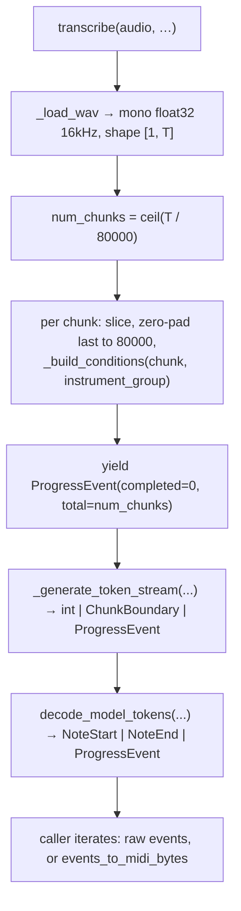

# The Transcription Pipeline Orchestrator

`muscriptor/transcription_model.py` is the front door of the codebase. Everything a caller touches to turn audio into MIDI goes through the single class `TranscriptionModel` (`muscriptor/transcription_model.py:245`): the CLI (`muscriptor/main.py`), the HTTP server, and the integration tests all construct it with `load_model()` and then call `transcribe()` or `transcribe_to_midi()`. The module owns three responsibilities that the rest of the codebase deliberately does *not*: (1) resolving a loose `--model` value into concrete weights plus an architecture config and building the `LMModel`; (2) slicing an arbitrary-length waveform into fixed 5-second chunks, conditioning each one, and orchestrating batched autoregressive generation into an ordered token stream; and (3) reassembling that stream (via `decode_model_tokens`) into note events and, optionally, a MIDI file. It is the only place that knows how to go from "a file path and some flags" to "a stream of `NoteStartEvent`/`NoteEndEvent`/`ProgressEvent`". This chapter covers the file exhaustively; the model internals it drives (`LMModel.generate`, conditioners, the MT3 tokenizer, the event decoder) are covered in sibling chapters and only summarized here where the orchestrator depends on their exact contract.

## Module-level constants and config tables

Two sampling/audio constants pin the pipeline to the training regime:

- `_SAMPLE_RATE = 16000` (`muscriptor/transcription_model.py:87`) — all audio is normalized to 16 kHz mono before it reaches the model.
- `_SEGMENT_DURATION = 5.0` (`muscriptor/transcription_model.py:89`) — the fixed chunk length. The comment stresses it *must* match training/eval; a segment is `int(5.0 * 16000) = 80000` samples.

Model architecture is described by the `_ModelConfig` dataclass (`muscriptor/transcription_model.py:92`) with four fields — `dim`, `num_heads`, `num_layers`, `card`. The per-variant table `_CONFIGS` (`muscriptor/transcription_model.py:103`) is the fallback when no `config.json` is available:

| size | dim | num_heads | num_layers | card |
|------|-----|-----------|------------|------|
| large | 1536 | 24 | 48 | 1395 |
| medium | 1024 | 16 | 24 | 1395 |
| small | 768 | 12 | 14 | **1393** |

Note the `card` asymmetry: `small` has `card=1393`, exactly the number of decodable tokens in the tokenizer vocabulary (see "Gotchas"), while `medium`/`large` have `card=1395` — two extra output-head slots that generation always masks off. `_DEFAULT_CONFIG = _CONFIGS["large"]` (`muscriptor/transcription_model.py:109`) is the last-resort architecture when nothing else resolves. This is *not* the same as `_DEFAULT_SIZE = "medium"` (`muscriptor/transcription_model.py:71`), which is the default *download target*; the two defaults live at different layers and disagree on purpose (see "Gotchas").

`_LEGACY_CONFIGS` (`muscriptor/transcription_model.py:113`) maps four 8-hex checkpoint tags (embedded in old local filenames like `..._01684fbb_...`) to their variant configs, so pre-release checkpoints still load without a `config.json`.

Published variants live at `hf://MuScriptor/muscriptor-<size>/model.safetensors` via `_HF_REPO_TEMPLATE` (`muscriptor/transcription_model.py:69`), and `_MODEL_SIZES = ("small", "medium", "large")` (`muscriptor/transcription_model.py:70`) is the set of recognized size keywords.

### `_timed` — stderr timing instrumentation

`_timed(label, store)` (`muscriptor/transcription_model.py:51`) is a context manager that brackets a block with `torch.cuda.synchronize()` on entry and exit (only when CUDA is available), measures `time.perf_counter()` wall time, prints `[muscriptor] <label>: <dt>s` to **stderr**, and optionally appends `(label, dt)` to a `store` list. The synchronize calls matter: without them a CUDA timing would measure only kernel-launch time, not execution. `transcribe()` uses it for the `"load audio"` and `"build conditions"` phases.

## `load_model()` — from a `--model` value to a ready model

`TranscriptionModel.load_model(weights_path=None, device=None)` (`muscriptor/transcription_model.py:265`) is a classmethod returning a fully-initialized instance. Its steps, in order:

**Device auto-selection** (`muscriptor/transcription_model.py:281`): `None` → `torch.device("cuda")` if `torch.cuda.is_available()` else `"cpu"`; a `str` is wrapped in `torch.device`; a `torch.device` passes through. The CLI maps its `--device auto` to `None` (`muscriptor/main.py:199`) so `"auto"` never reaches here.

**Source resolution** — `_resolve_source(weights_path)` (`muscriptor/transcription_model.py:74`): `None` becomes `"medium"` (`_DEFAULT_SIZE`), and a bare size keyword in `_MODEL_SIZES` is expanded through `_HF_REPO_TEMPLATE` into a full `hf://…/model.safetensors` URL. Anything else — a local path, an `hf://` URL, an `http(s)://` URL — is returned unchanged.

**Download handoff** — `download_if_necessary(source)` (`muscriptor/utils/download.py:39`) turns the source into a concrete local `Path`. It dispatches on prefix: `hf://org/name/path` is fetched with `hf_hub_download` (gated/401/403 failures are converted to a `ModelDownloadError` carrying a human-readable auth message); `http(s)://` is fetched with a hashed cache filename under `~/.cache/muscriptor/` using a temp-file-then-rename to avoid partial files; anything else is treated as an existing local file (raising `FileNotFoundError` if absent). The returned `weights_path` is always a local file.

**Config resolution** — `_resolve_config(source, weights_path)` (`muscriptor/transcription_model.py:130`) determines the architecture, most-to-least authoritative:

1. A `config.json` sitting next to the weights (`weights_path.parent / "config.json"`). If not present locally, it tries `download_companion(source, "config.json")` (`muscriptor/utils/download.py:96`), a best-effort fetch of the sibling file from the same `hf://` repo (returns `None` for non-`hf://` sources or any fetch failure). If a config file is found either way, `_config_from_json` reads the four `_CONFIG_FIELDS` from it.
2. Otherwise, a `muscriptor-(large|medium|small)` regex on `str(source)` → the matching `_CONFIGS` entry. This is why a size keyword resolves correctly even fully offline: the expanded URL still contains `muscriptor-medium`.
3. Otherwise, a `_([0-9a-f]{8})_` regex on the *filename* → `_LEGACY_CONFIGS` if the tag is known.
4. Otherwise `_DEFAULT_CONFIG` (large).

**Model construction** — `_build_model(device, cfg)` (see below), then `model.eval()`.

**Weight loading** (`muscriptor/transcription_model.py:291`): `load_file(weights_path, device=str(device))` (safetensors) loads the raw state dict directly onto the target device; `_remap_single_codebook_keys` adapts it; `model.load_state_dict` applies it; `model.to(device)` is a redundant-but-cheap safety net.

**Tokenizer** (`muscriptor/transcription_model.py:296`): `MT3Tokenizer(instrument_vocabulary="MT3_FULL_PLUS", max_shift_steps=1001)`. The vocabulary choice fixes the instrument-group program map; `max_shift_steps=1001` gives shift tokens `0..1000` (10 s of headroom at 100 Hz), and the tokenizer's default `frame_rate=100`.

### `_remap_single_codebook_keys` — legacy checkpoint adaptation

`_remap_single_codebook_keys(state_dict)` (`muscriptor/transcription_model.py:157`) bridges older multi-codebook checkpoints to the single-stream `LMModel`. Old checkpoints stored the embedding and output head as element 0 of an `nn.ModuleList` (`emb.0.*`, `linears.0.*`); this renames them to `emb.*` and `linear.*`. Crucially, if **any** key starts with `emb.1.` or `linears.1.` (a second codebook, `n_q > 1`), it raises `ValueError` — multi-codebook models are categorically unsupported. A modern single-stream checkpoint (keys already `emb.*`/`linear.*`) passes through untouched.

### `_build_model` — conditioner wiring and autocast

`_build_model(device, cfg)` (`muscriptor/transcription_model.py:180`) assembles the `LMModel` and its `ConditioningProvider`. Three conditioners are wired under fixed names:

- `self_wav`: a `MelSpectrogramConditioner` (`output_dim=cfg.dim`, `sample_rate=16000`, `n_fft=2048`, `frame_rate=100`, `n_mel_bins=512`, `log_scale=True`, `eps=1e-6`, `normalize_audio=False`) — the audio itself.
- `instrument_group`: a `ClassConditioner(num_classes=1000, output_dim=cfg.dim)` — the optional instrument hint.
- `dataset_name`: a `ClassConditioner(num_classes=4, output_dim=cfg.dim)` — always unconditional at inference.

The autocast is the one device-dependent piece: only when `device.type == "cuda"` is a `TorchAutocast(enabled=True, device_type="cuda", dtype=torch.float16)` created (`muscriptor/transcription_model.py:205`); on CPU it stays `None`, and `LMModel` substitutes a disabled autocast. So **fp16 compute happens only on CUDA**; CPU runs in full precision. The `LMModel` is built with `card=cfg.card`, `dim=cfg.dim`, `num_heads=cfg.num_heads`, `hidden_scale=4`, `cfg_coef=1.0`, the autocast, and `num_layers`/`max_period=10000` forwarded through `**kwargs` to the `StreamingTransformer`.

### `_build_instrument_for_program` — decoded program → readable name

`_build_instrument_for_program(tokenizer)` (`muscriptor/transcription_model.py:224`) returns a closure used during decoding. It inverts the tokenizer's `group_program_map`: for each `(name, gid)` in `MT3_FULL_PLUS_GROUP_NAMES`, it maps the **representative** (first) program of that group back to the readable name. The returned `lookup(program)` returns `"drums"` for `DRUM_PROGRAM` (128), the group name for a known representative program, or `"program_<n>"` for anything else. The model only ever emits a group's first program, so mapping only the representative is sufficient. This closure is stored as `self._instrument_for_program` in `__init__` (`muscriptor/transcription_model.py:263`) and handed to `decode_model_tokens`.

## `transcribe()` — the streaming flow

`transcribe(audio, use_sampling=False, temperature=1.0, cfg_coef=1.0, instruments=None, batch_size=None, no_eos_is_ok=True, beam_size=1)` (`muscriptor/transcription_model.py:304`) is a **generator** yielding `NoteStartEvent | NoteEndEvent | ProgressEvent`. Because it is a generator, no work happens until the caller iterates, and the closing timing prints (`muscriptor/transcription_model.py:407`) only run if the generator is fully consumed.



**Batch size default** (`muscriptor/transcription_model.py:332`): `None` → `4` on CUDA, `1` on CPU. The web/server path uses `batch_size=1` so each chunk finishes as its own unit.

**Instrument constraint plumbing** (`muscriptor/transcription_model.py:337`): when `instruments` is given, it is used **two independent ways**, both derived from the same list:

- `instrument_group = instrument_group_from_names(instruments)` — a space-joined string of group ids (e.g. `["violin","viola"]` → `"9 10"`). This is the *advisory* conditioning, threaded into every chunk's `ConditioningAttributes` via `_build_conditions`.
- `forbidden_tokens = torch.tensor(self._tokenizer.forbidden_token_ids(instruments), device=…, dtype=torch.long)` — a *hard* mask. `forbidden_token_ids` (`muscriptor/tokenizer/mt3.py:233`) returns every `program` token whose value is not the representative program of an allowed group, plus all `drum` tokens unless `"drums"` is listed. These logits are forced to `-inf` at every generation step, so a forbidden instrument literally cannot be produced.

Callers must pass **exact** group names here; the CLI resolves abbreviations upstream via `resolve_instrument_names` (`muscriptor/main.py:175`) before calling in. `instrument_group_from_names` and `forbidden_token_ids` both raise `ValueError` on an unknown name.

**Audio loading** (`muscriptor/transcription_model.py:351`): two input shapes are accepted. A `(tensor, sample_rate)` tuple is unpacked and passed to `_load_wav(tensor, sample_rate)`; anything else (a `str`/`Path`) goes to `_load_wav(audio, None)`. Both are wrapped in `_timed("load audio")`.

**Segmentation** (`muscriptor/transcription_model.py:359`): `total_samples = wav.shape[-1]`, `segment_samples = 80000`, `num_chunks = math.ceil(total_samples / segment_samples)`, `max_gen_len = 2000`. A stderr line reports the audio duration and chunk count. Inside `_timed("build conditions")`, each chunk `wav[:, start:start+segment_samples]` is sliced; if the final chunk is short it is **zero-padded** to a full 80000 samples with `F.pad(chunk, (0, pad))` (`muscriptor/transcription_model.py:376`). Each chunk becomes one `ConditioningAttributes` via `_build_conditions(...)[0]`, and `seek_times.append(i * 5.0)` records each chunk's start time in seconds.

**Up-front progress anchor** (`muscriptor/transcription_model.py:387`): `yield ProgressEvent(completed=0, total=num_chunks)` is emitted *directly by transcribe*, before any tokens, so consumers immediately learn the total chunk count and get a `t0` timing baseline. (Unlike the trailing anchors, this one does not pass through `decode_model_tokens`.)

**Handoff** (`muscriptor/transcription_model.py:389`): `_generate_token_stream(...)` (the interleaved token producer) is wrapped by `decode_model_tokens(stream, self._tokenizer._vocab, self._instrument_for_program, frame_rate=self._tokenizer.frame_rate)` and re-yielded with `yield from`. `decode_model_tokens` (`muscriptor/events.py:67`) is the stateful decoder that turns raw token ints plus `ChunkBoundary` markers into note events, passing `ProgressEvent`s straight through untouched.

The decoder's contract is what dictates the producer's shape (details in `05-events-decoding.md`), and two aspects of it explain design choices here. First, each chunk in the stream begins with a *tie prologue* — the notes still sounding from the previous chunk — and the decoder holds open-note state *across* `ChunkBoundary` markers; that is why chunks must arrive strictly in order and why `_generate_token_stream` buffers out-of-order completions rather than interleaving them. Second, the decoder drops any note whose decoded time reaches `next_seek_time`, so a chunk cannot leak events past its own 5-second window into the next chunk's territory — which is exactly the field `boundary()` fills in, and why the final chunk (with `next_seek_time = None`) has no such guard.

**Closing instrumentation** (`muscriptor/transcription_model.py:407`): after the stream is exhausted, a final `cuda.synchronize()` and two stderr prints report `generate total` and `transcribe total` wall times. Note that the `timings` list accumulated by `_timed` is never read back — only `_timed`'s own per-block stderr prints surface (see "Gotchas").

## `_generate_token_stream()` — interleaved batched streaming

`_generate_token_stream(...)` (`muscriptor/transcription_model.py:420`) is the heart of the orchestrator and the subtlest code in the file. It yields a flat stream of `int | ChunkBoundary | ProgressEvent`. The tension it resolves: `LMModel.generate` produces **one token per chunk per timestep across the whole batch** (each yield is a `[n]` tensor, `n` = chunks in this batch — `muscriptor/models/lm.py:430`), but the downstream decoder consumes **whole chunks strictly in order**. So the batch is generated in lockstep, but only one chunk at a time is streamed to the decoder; the rest are buffered until their turn.

Per batch (`range(0, num_chunks, batch_size)`), it maintains:
- `buffers[j]` — a per-chunk token list for chunks not currently live.
- `done[j]` — whether chunk `j` has emitted EOS.
- `active` — the within-batch index of the single chunk being streamed live.

The algorithm:

```python
yield boundary(batch_start)              # chunk 0 of the batch streams live
for step in self._model.generate(...):   # step is [n], one token per chunk
    row = step.tolist()
    for j in range(n):
        if done[j]: continue
        tok = row[j]
        if tok == eos_id:   done[j] = True
        elif j == active:   yield tok      # live chunk: emit immediately
        else:               buffers[j].append(tok)   # others: buffer
    while active < n and done[active]:     # live chunk finished → advance
        active += 1
        if active < n:
            yield boundary(batch_start + active)
            yield from buffers[active]; buffers[active] = []
```

EOS (and everything after it, since `done[j]` is then permanently set) is dropped and never yielded. When the live chunk hits EOS, the `while` loop advances `active`, emits the next chunk's `ChunkBoundary`, flushes its buffered tokens, and streams it live from then on — repeating if several chunks finished while an earlier one was still open.

```mermaid
stateDiagram-v2
    [*] --> Init
    Init --> Streaming: yield boundary(batch_start), active=0
    Streaming --> Streaming: token for active → yield;<br/>token for others → buffer;<br/>EOS → done[j]=True
    Streaming --> Advance: done[active] is True
    Advance --> Streaming: active++;<br/>yield boundary(active) + flush buffer[active]
    Streaming --> Cleanup: generate() exhausted (all EOS or max_gen_len)
    Cleanup --> [*]: per still-open chunk: warn or raise;<br/>flush any un-streamed chunks in order;<br/>yield ProgressEvent(completed=batch_start+n)
```

`boundary(chunk_index)` (`muscriptor/transcription_model.py:445`) builds `ChunkBoundary(seek_times[chunk_index], next_seek_time)`, where `next_seek_time` is the following chunk's seek time or `None` for the last chunk. The decoder uses `next_seek_time` to drop events the model emits past its window.

**No-EOS handling** (`muscriptor/transcription_model.py:492`): after `generate` is exhausted, any chunk still not `done` never emitted EOS within `max_gen_len=2000` tokens. For each such chunk a message is built; if `no_eos_is_ok` (the default; CLI `--strict-eos` inverts it) it becomes a `RuntimeWarning`, otherwise a `RuntimeError`. In the same loop, any chunk `j != active` that hasn't been streamed yet (buffered but never reached because an earlier chunk stalled) gets its boundary and buffer flushed — so a *completed* later chunk is still emitted even when an earlier chunk stalls, preserving order. Because the live chunk streams tokens *as they generate*, under `--strict-eos` a stalled chunk's tokens may already have reached the consumer before the `RuntimeError` is raised in cleanup.

**Trailing progress anchor** (`muscriptor/transcription_model.py:515`): each batch ends with `yield ProgressEvent(completed=batch_start + n, total=num_chunks)`. The event is emitted *after* all of the batch's tokens, so once it surfaces through `decode_model_tokens` every note in those chunks has already been yielded — it is a true "these chunks are done" marker. With `batch_size=1` (the server path) this is one anchor per chunk, giving completions `0,1,2,…,total`; with `batch_size=4` the completions jump by four (`0,4,8,…,total`), so "one anchor per chunk" is *not* a general invariant. This ordering is verified end-to-end in `tests/test_transcription_model.py` (e.g. `test_first_chunk_streams_before_the_batch_finishes` asserts chunk 0 streams after only its own timesteps, and `test_later_chunk_finishing_first_is_buffered_until_its_turn` asserts a chunk that EOSes early still waits its turn).

Generation parameters are passed straight through to `LMModel.generate`: `use_sampling`, `temp=temperature`, `top_k=0`, `top_p=0.0`, `cfg_coef`, `early_stop_on_token=eos_id`, `beam_size`, `forbidden_tokens`. For `beam_size > 1`, `generate` runs beam search non-streamingly and yields all rows at the end (`muscriptor/models/lm.py:525`), so the live-streaming benefit disappears but this function's ordering logic still holds.

## `transcribe_to_midi()` and `events_to_midi_bytes()` — note reassembly and MIDI

`transcribe_to_midi(...)` (`muscriptor/transcription_model.py:518`) is a thin wrapper: it forwards every argument to `transcribe(...)` and pipes the event stream into `events_to_midi_bytes`, returning MIDI as `bytes`.

`events_to_midi_bytes(events)` (`muscriptor/transcription_model.py:542`) is shared by the CLI and the HTTP server so the byte output is identical regardless of how the events were produced. It reassembles `Note` objects from the paired start/end stream:

- `ProgressEvent`s are skipped.
- On a `NoteStartEvent`: the program is resolved — `DRUM_PROGRAM` (128) if `ev.instrument == "drums"`, else `self._program_for_instrument(ev.instrument)`. A readable track name (`ev.instrument.replace("_", " ")`) is recorded in `program_names[program]`. A `Note` is created with `onset = ev.start_time` and a *placeholder* `offset = ev.start_time`, then stashed in `open_notes[ev.index]` keyed by the note's start index.
- On a `NoteEndEvent`: `open_notes.pop(ev.start_event_index)` retrieves the matching note (relying on the module invariant that every start has exactly one later end with the same index), patches `note.offset = ev.end_time`, and appends it to the finished list.

Two legacy-compat cleanup passes then run (`muscriptor/transcription_model.py:579`) to keep the bytes bit-identical to earlier reference outputs: `validate_notes(notes, fix=True)` repairs `onset > offset` and too-short non-drum notes (`muscriptor/tokenizer/notes.py:70`), and `trim_overlapping_notes(notes, sort=True)` clamps each same-`(program, pitch, is_drum)` note's offset to the next note's onset, drops non-positive-duration notes, and sorts (`muscriptor/tokenizer/notes.py:89`). Finally `notes_to_midi(notes, program_names=program_names)` (`muscriptor/utils/midi.py:8`) produces a type-1 (multi-track) `mido.MidiFile` — one named track per program so DAWs like Ableton keep instruments separate — and it is serialized to `bytes` via `midi.save(file=buf)` into an `io.BytesIO`.

`_program_for_instrument(instrument)` (`muscriptor/transcription_model.py:586`) is the lazy inverse of `_build_instrument_for_program`. On first call it builds and memoizes `self._inst_to_program` from `MT3_FULL_PLUS_GROUP_NAMES` and the tokenizer's `group_program_map` (name → representative program). It returns the mapped program for a known name; for a `"program_<n>"` fallback name it parses out `int(n)`; otherwise it raises `ValueError`. Drums never reach here — the caller intercepts `"drums"` first.

## `_load_wav()` and `_build_conditions()`

`_load_wav(audio, sample_rate)` (`muscriptor/transcription_model.py:603`) always returns a mono float32 waveform at 16 kHz, shape `[1, T]`, on `self._device`. A `str`/`Path` is routed to `load_audio(audio, target_sr=16000)` (`muscriptor/utils/audio.py:92`), which dispatches by content (stdlib `wave` first, `soundfile` fallback) and downmixes/resamples internally. A raw tensor is coerced in-place: `.float()`, then a 1-D tensor gets a leading channel dim, a 3-D tensor is squeezed to 2-D, multi-channel is averaged to mono with `mean(0, keepdim=True)`, and if a `sample_rate` was supplied and differs from 16 kHz it is `resample`d. The final `.to(self._device)` is the point where audio lands on the model's device. The tensor-input branch's reshaping is exercised directly by `tests/test_integration.py` (`test_load_wav_1d_tensor`, `test_load_wav_stereo_to_mono`, `test_load_wav_resamples`).

`_build_conditions(wav, instrument_group=None)` (`muscriptor/transcription_model.py:621`) builds the single-element `[ConditioningAttributes]` list for one 5-second chunk. It reshapes `wav` (`[1, T]`) to `[1, 1, T]` for the `WavCondition` (`wav`, `length=[T]`, `sample_rate=[16000]`, `path=[None]`, `seek_time=[0.0]`), and packs it under the `self_wav` key. The `text` dict carries `instrument_group` (the constraint string, or `None`) and `dataset_name` **always `None`** — inference is unconditional on dataset, using the null/pad class. The `[1,1,T]` wav shape and `length` are asserted by `tests/test_integration.py::test_build_conditions_wav_shape`.

## Gotchas & invariants

- **The two "defaults" disagree by design.** `_DEFAULT_SIZE = "medium"` governs what gets *downloaded* when `weights_path is None`; `_DEFAULT_CONFIG = _CONFIGS["large"]` governs the *architecture* only as `_resolve_config`'s last resort. A `None` model resolves end-to-end to medium (the URL contains `muscriptor-medium`, caught by the regex). `_DEFAULT_CONFIG` (large) is reached only for a mystery local checkpoint with no `config.json`, no `muscriptor-<size>` in its path, and no known 8-hex tag — and if that checkpoint isn't actually large, `load_state_dict` will fail with a shape mismatch rather than silently mis-load.

- **`card` 1393 vs 1395 is load-bearing across files.** The tokenizer vocabulary built by `build_event_vocab(1001)` has exactly 1393 entries (3 special + 1001 shift + 128 pitch + 2 velocity + 1 tie + 130 program + 128 drum). `decode_model_tokens` indexes `vocab[item]`, so any generated token id ≥ 1393 would `IndexError`. `LMModel._compute_logits` guards this with a **hardcoded** `logits[:, 1393:] = -torch.inf` (`muscriptor/models/lm.py:223`), forcing the two extra head slots of the `medium`/`large` models (`card=1395`) to be unsamplable. The `small` model (`card=1393`) has no extra slots, so that slice is a no-op there. Changing the vocabulary size without updating that hardcoded `1393` would break decoding.

- **The last chunk is zero-padded and the model isn't told.** `_build_conditions` reports `length = padded_T` (always 80000), so the conditioner treats the final short chunk as a full 5 s of audio. For the last chunk `next_seek_time` is `None`, so `decode_model_tokens` applies no time-based drop — notes the model hallucinates in the silent padded tail are *not* filtered out (they usually don't occur because the padding is exact zeros, but this is not guaranteed).

- **`--strict-eos` can partially emit before raising.** Because the live chunk streams tokens as they are generated, a stalled chunk's tokens may already have reached the consumer (and, for the CLI's `jsonl` format, been written to the sink) before the `RuntimeError` is raised in the post-generation cleanup. The raise is not atomic with respect to the stream.

- **"One `ProgressEvent` per chunk" holds only at `batch_size=1`.** With the CUDA default `batch_size=4`, completion anchors jump by four. Consumers that count anchors must read `completed`/`total`, not assume unit steps. The up-front `completed=0` anchor is emitted by `transcribe` itself and bypasses `decode_model_tokens`; the trailing anchors are emitted by `_generate_token_stream` and pass through it untouched.

- **EOS is dropped, and events past `max_gen_len` are lost.** A chunk that never emits EOS within 2000 tokens is either warned or raised on; its already-streamed tokens are decoded as-is with no clean chunk terminator except the next `ChunkBoundary`.

- **The `timings` list is dead accumulation.** `transcribe` builds a `timings` list and passes it to `_timed`, but never reads it back; only `_timed`'s own per-block stderr prints are observable. Removing the list would change nothing user-visible.

- **`transcribe` is lazy.** As a generator it does no work — not even model loading of audio — until iterated, and its closing `cuda.synchronize()` plus timing prints only run on full consumption. A consumer that breaks early skips them.

- **Instrument constraint is enforced twice, from one source.** The advisory `instrument_group` conditioning and the hard `forbidden_tokens` mask are derived from the same `instruments` list but are independent mechanisms; only the mask actually *prevents* an instrument from appearing. Names must be exact here — abbreviation resolution happens upstream in the CLI.

- **The CLI overrides the model dtype after loading.** `_build_model` sets up an fp16 CUDA autocast, but `muscriptor/main.py:207` does `model._model = model._model.to(torch.float32)` right after `load_model`. So through the CLI the weights are fp32; on CUDA the autocast still runs matmuls in fp16 regardless of weight dtype, while on CPU everything is fp32. Callers using the library directly (server, tests) keep whatever dtype the weights were loaded in.

- **Generation leaks a few lines to stdout, not stderr.** `transcribe`'s own instrumentation is disciplined stderr-only, but `LMModel.generate` prints `[muscriptor] encode conditions (total): …` via a bare `print` (`muscriptor/models/lm.py:313`, and more under `cfg_coef != 1.0`) which goes to **stdout**. When the CLI writes MIDI/JSON to `-o -` (stdout), these lines interleave ahead of the real output. This is model-core behavior, but it breaks the pipeline's otherwise clean "stdout = output only" contract.

## Cross-references

- `02-model-core.md` — `LMModel.generate` (yield shape, greedy/sampling/beam paths, the `logits[:, 1393:]` and `forbidden_tokens` masking, KV-cache/streaming state).
- `03-conditioning-audio.md` — `MelSpectrogramConditioner`, `ClassConditioner`, `ConditioningProvider`, `WavCondition`/`ConditioningAttributes`, and the audio I/O (`load_audio`, `resample`) that `_load_wav` relies on.
- `04-tokenizer.md` — `MT3Tokenizer`, `MT3_FULL_PLUS_GROUP_NAMES`, `instrument_group_from_names`, `forbidden_token_ids`, `group_program_map`, and `build_event_vocab` (the 1393-entry table).
- `05-events-decoding.md` — `decode_model_tokens`, `ChunkBoundary`, `NoteStartEvent`/`NoteEndEvent`/`ProgressEvent`, and the `notes.py`/`midi.py` note-cleanup and MIDI serialization path.
- `06-cli-packaging.md` — `muscriptor/main.py` (`--model`/`--device`/`--instruments`/`--strict-eos` plumbing, output formats) and `download.py`.
- `07-server-web.md` — the HTTP server that also calls `transcribe` / `events_to_midi_bytes` with `batch_size=1`.
- `08-tests.md` — `tests/test_transcription_model.py` (streaming contract) and `tests/test_integration.py` (end-to-end).
