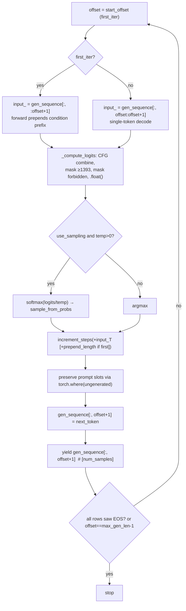

# 02 — Neural Model Core & Token Generation

This chapter documents the transformer language model that turns a conditioned audio chunk into a stream of MIDI tokens, and the autoregressive machinery that drives it. Everything here lives under `muscriptor/models/` and `muscriptor/modules/`. The pipeline layer (chapter 01) builds one `ConditioningAttributes` per 5-second chunk, calls `LMModel.generate(...)`, and consumes the per-step token tensors it yields; this chapter is the other side of that contract. The model is a single-stream, decoder-only causal transformer (adapted from `audiocraft/models/lm.py`) with **prefix conditioning**: the audio/class conditions are encoded to embedding vectors and prepended to the token sequence, so the model attends to them through ordinary causal self-attention rather than cross-attention. Inference is fully streaming — a preallocated KV cache lets each decode step feed a single new token through the stack — with an optional non-streaming beam-search path layered on top.

## Component map

| File | Role |
| --- | --- |
| `muscriptor/models/lm.py` | `LMModel` (embedding, transformer, output head), CFG logits, sampling glue, the `generate()` loop, beam search, `ScaledEmbedding`, `TorchAutocast`. |
| `muscriptor/modules/transformer.py` | `StreamingTransformer` stack, `StreamingTransformerLayer`, `StreamingMultiheadAttention` (KV cache + SDPA kernel selection), sinusoidal positions. |
| `muscriptor/modules/streaming.py` | `StatefulModule` base + `init_states` / `increment_steps`: the mechanism that threads per-module KV/offset state through `forward`. |
| `muscriptor/utils/sampling.py` | `multinomial`, `sample_top_k`, `sample_top_p`, `sample_from_probs`, plus `length_to_mask` and the (pipeline-unused) `sample_stratified`. |

## Token vocabulary and special IDs

`LMModel` reasons about three sentinel token ids, all defined as properties (`muscriptor/models/lm.py:139`-`149`):

- `initial_token_id == card` — the start-of-sequence token written to column 0 of the generation buffer (`lm.py:141`). Because it equals `card`, it is exactly the extra row added to the embedding table below.
- `zero_token_id == -1` — a negative sentinel that `ScaledEmbedding` maps to the zero vector (`lm.py:145`).
- `ungenerated_token_id == -2` — a buffer sentinel meaning "not yet produced" (`lm.py:149`). It marks empty slots in the generation buffer and is never fed to the embedding as a real input in normal operation.

The output-head width is `card`, which the pipeline sets per model variant: `1395` for medium/large, `1393` for small (`muscriptor/transcription_model.py:104`-`106`) — note this is the *head width*, not the decodable vocabulary, which is always the tokenizer's 1393 entries (see `04-tokenizer.md`). The output head therefore has `card` columns, but `_compute_logits` hard-masks everything from index `1393` upward to `-inf` (`lm.py:223`), so the effective usable vocabulary is `0..1392` regardless of variant. For medium/large this discards two reserved/out-of-vocabulary logits (1393, 1394); for small the slice is empty and the mask is a no-op.

## `ScaledEmbedding`

`ScaledEmbedding` (`lm.py:37`-`49`) subclasses `nn.Embedding` and adds one behavior: any input equal to `zero_idx` (a required-negative index) embeds to a zero vector instead of a table lookup. It clamps inputs to `min=0` before the parent lookup (so the negative sentinel doesn't index out of bounds) and then overwrites those positions with zeros via `torch.where`:

```python
def forward(self, input, *args, **kwargs):
    is_zero = input == self.zero_idx
    input = input.clamp(min=0)
    y = super().forward(input, *args, **kwargs)
    return torch.where(is_zero[..., None], torch.zeros_like(y), y)
```

`LMModel` instantiates it with `card + 1` rows and `zero_idx = zero_token_id (-1)` (`lm.py:116`-`122`). The `+1` row accommodates `initial_token_id == card`. Note the clamp maps the `-2` ungenerated sentinel to row `0` (not to a zero vector), so relying on `ScaledEmbedding` to neutralize ungenerated slots would be wrong — the generation loop instead guarantees those slots are filled before they are ever used as input.

## `LMModel` construction and weight layout

`LMModel.__init__` (`lm.py:94`-`133`) wires four submodules:

- `self.emb` — the `ScaledEmbedding` above (`lm.py:116`). Checkpoint key prefix `emb.*`.
- `self.transformer` — a `StreamingTransformer` built with `d_model=dim`, `num_heads`, `dim_feedforward=int(hidden_scale * dim)`, and any extra `**kwargs` (the pipeline forwards `num_layers` and `max_period=10000` this way) (`lm.py:124`-`131`). `hidden_scale` defaults to 4, so the FFN width is `4 * dim`.
- `self.out_norm` — a `LayerNorm(dim, eps=1e-5)` applied to the transformer output before the head (`lm.py:132`).
- `self.linear` — the output head, `nn.Linear(dim, card, bias=False)` (`lm.py:133`). Checkpoint key prefix `linear.*`.

`condition_provider`, `card`, `dim`, and `cfg_coef` are stored as attributes; `autocast` defaults to a disabled `TorchAutocast` when none is passed (`lm.py:108`-`114`).

**Checkpoint compatibility.** The safetensors files this class loads use the flat keys `emb.*` and `linear.*`. Older audiocraft-style checkpoints stored the embedding and head as element 0 of an `nn.ModuleList` (`emb.0.*` / `linears.0.*`); the pipeline's `_remap_single_codebook_keys` (`transcription_model.py:157`-`177`) rewrites those to `emb.*` / `linear.*` before `load_state_dict`, and rejects any checkpoint carrying a second codebook (`emb.1.*`). This is why `LMModel` is described as "single-stream": exactly one embedding table and one head.

The pipeline constructs the model in `_build_model` (`transcription_model.py:180`-`221`) with `cfg_coef=1.0` baked in as the module default and the `StreamingTransformer` kwargs (`num_layers`, `max_period`) passed through `**kwargs`.

## `forward`: prefix conditioning and the output head

`LMModel.forward` (`lm.py:155`-`185`) takes a token sequence `[B, S]`, a dict of condition tensors, a `first_step` flag, and an optional `model_state`. It:

1. Embeds tokens: `input_ = self.emb(sequence)` → `[B, S, D]` (`lm.py:164`).
2. **On the first step only**, prepends every condition embedding along the time axis (`lm.py:167`-`170`):
   ```python
   if first_step:
       for cond, _ in condition_tensors.values():
           input_ = torch.cat([cond, input_], dim=1)
       prepend_length = input_.shape[1] - S
   ```
   Each condition is a `(embedding [B, T, D], mask [B, T])` tuple; only the embedding is prepended (the mask is unused inside the LM). Because each `torch.cat` puts the new condition in front, the final prefix order is the *reverse* of the dict-iteration order. With the pipeline's provider that order is mel (`self_wav`) frames first, then the two class tokens (`dataset_name`, `instrument_group`), then the real token sequence. `prepend_length` is the total number of prefix positions.
3. Runs the transformer, applies `out_norm`, then slices off the prefix so only the `S` real positions remain: `transformer_out = transformer_out[:, -S:]` (`lm.py:181`-`182`).
4. Projects to logits: `self.linear(transformer_out)` → `[B, S, card]` (`lm.py:184`).

Conditioning therefore enters as a **causal prefix in the KV cache**, not via cross-attention and not by summation into the token embeddings. On decode steps (`first_step=False`) nothing is prepended — the condition prefix already lives in the KV cache from step one, and later single-token queries attend back to it.

## The stateful streaming API (`streaming.py`)

Streaming state is explicit and buffer-based — "no magic context manager, no implicit per-module storage" (`streaming.py:10`). `StatefulModule` (`streaming.py:22`-`37`) is an `nn.Module` mixin exposing:

- `init_state(batch_size, sequence_length) -> State` (abstract) — allocate this module's per-run tensors.
- `increment_step(state, increment=1)` — advance this module's step counter (default no-op).
- `get_state(model_state)` — return this module's slot from the shared dict, keyed by `self._module_absolute_name`, or `None` if no state was allocated.

`init_states(model, batch_size, sequence_length)` (`streaming.py:40`-`51`) walks `model.named_modules()`, and for every `StatefulModule` it (a) records the module's dotted path in `_module_absolute_name` and (b) calls `init_state`, collecting the results into a `dict[name -> State]`. That dotted name is the join key: `get_state` later looks the module up by it. `increment_steps(model, model_state, increment)` (`streaming.py:54`-`68`) bumps every stateful submodule's counter in one pass, using the same names, so it works even when called on a subtree.

Two module types are stateful: `StreamingMultiheadAttention` (holds the KV `cache` and a scalar `offset`) and `StreamingTransformer` (holds a per-row `offsets` vector for positions). `StreamingTransformerLayer` is a plain `nn.Module` that merely forwards `model_state` down to its attention. If `model_state is None`, `get_state` returns `None` and every module runs statelessly — this is the full-sequence, non-cached path exercised by the transformer unit tests (`tests/test_transformer.py:48`-`54`).

## `StreamingTransformer`

`StreamingTransformer` (`transformer.py:149`-`211`) is a `StatefulModule` holding a `ModuleList` of `num_layers` `StreamingTransformerLayer`s (`transformer.py:165`-`176`). Its state is a single `offsets` tensor of shape `[batch_size]`, all zeros at init (`transformer.py:178`-`182`); `increment_step` adds the increment to every element (`transformer.py:184`-`185`).

`forward` (`transformer.py:187`-`211`) adds **sinusoidal absolute positional encodings** and runs the layer stack:

```python
positions = torch.arange(T, device=x.device).view(1, -1, 1)
positions = positions + offsets.view(-1, 1, 1)
pos_emb = create_sin_embedding(positions, C, max_period=self.max_period, dtype=x.dtype)
x = x + pos_emb * (positions >= 0).float()
```

Positions are `arange(T)` shifted by the per-row `offsets`, so during decode a single query at absolute position `offset` gets the correct encoding for its place in the (prefix + tokens) stream. `create_sin_embedding` (`transformer.py:11`-`23`) builds the sinusoidal table with `max_period=10000`, concatenating a `cos` half and a `sin` half along the channel dim (`torch.cat([cos(phase), sin(phase)], dim=-1)` — halves, not the classic interleaving); this is **sinusoidal, not RoPE**, and it is added to the hidden state (not applied to Q/K). The `(positions >= 0)` gate is always true in this pipeline (offsets never go negative), so it is effectively a no-op guard carried over from the source implementation. Note that the `prepend_length` argument to `forward` is explicitly discarded — `del prepend_length` (`transformer.py:193`) — because positions come from `offsets`, which the caller has already advanced to include the prefix.

`StreamingTransformerLayer` (`transformer.py:118`-`146`) is a **pre-norm** block with no biases anywhere:

```python
x = x + self.self_attn(self.norm1(x), model_state=model_state)
x = x + self.linear2(F.gelu(self.linear1(self.norm2(x))))
```

Two `LayerNorm(eps=1e-5)`s, a `linear1: d_model -> dim_feedforward`, `GELU`, and `linear2: dim_feedforward -> d_model` (`transformer.py:131`-`137`). With `hidden_scale=4` the FFN hidden width is `4 * d_model`.

## `StreamingMultiheadAttention` and the SDPA kernel strategy

`StreamingMultiheadAttention` (`transformer.py:26`-`115`) is causal self-attention with a preallocated KV cache. Its projections are a fused, bias-free `in_proj_weight` of shape `[3*embed_dim, embed_dim]` (Q/K/V packed) and a bias-free `out_proj` (`transformer.py:42`-`45`). Because the `Linear` is built with `bias=False`, `in_proj_bias` is `None` and `forward` uses `nn.functional.linear(query, self.in_proj_weight)` with no bias term (`transformer.py:78`).

The KV cache is allocated by `init_state` (`transformer.py:47`-`57`) as a single tensor of shape `[2, batch_size, sequence_length, num_heads, dim_per_head]` filled with NaN, plus a scalar `offset` counter. `_complete_kv` (`transformer.py:62`-`70`) writes the current step's K and V into the cache at `[.., offset : offset+T, ..]` and returns views over everything written so far (`0 : offset+T`), so the query attends to the full history:

```python
cache[0, :, end : end + T] = k
cache[1, :, end : end + T] = v
return cache[0, :, : end + T], cache[1, :, : end + T]
```

The `offset` is a single scalar shared across the batch, which is correct here because every batch row advances in lockstep.

**Kernel selection (the causal-vs-decoding split).** After reshaping to `[B, heads, T, head_dim]`, `forward` dispatches to one of two `F.scaled_dot_product_attention` calls, chosen purely by the query/key lengths (`transformer.py:97`-`110`):

- **`T_q == 1` (single-token decode):** call SDPA with **no mask and no `is_causal`**. One query row aligned to the newest position needs no masking — it should attend to all cached keys — so no attention mask is built.
- **`T_q == T_k` (square prefill, the first step):** call SDPA with `is_causal=True`.
- **anything else:** `raise NotImplementedError` (`transformer.py:106`-`110`) — unused in practice.

The extended comment at `transformer.py:89`-`96` explains why this matters. Causality must be *bottom-right aligned* so a streaming step (`T_q=1`, `T_k=cache_len`) attends to all past tokens. PyTorch's `is_causal=True` is *top-left aligned*, which for `T_q < T_k` would incorrectly mask out every cached token except position 0 — so `is_causal` cannot be used for the decode step. The obvious fix, passing an explicit `attn_mask`, would force SDPA onto its **unfused math fallback** and lose the fused flash kernel. The code sidesteps both problems: the two shapes this model actually hits (single-token decode and square prefill) are exactly the two that need *no* attention mask, so both stay on the fused (flash) CUDA/CPU kernels. This is the optimization introduced by the "Use kernels optimized for causal and decoding" change.

## `TorchAutocast` and precision

`TorchAutocast` (`lm.py:57`-`79`) is a thin context manager wrapping `torch.autocast`. When `enabled`, `__enter__` opens `torch.autocast(device_type, dtype)`; when disabled it is a no-op. The pipeline enables it **only on CUDA**, with `dtype=torch.float16` (`transcription_model.py:204`-`206`); on CPU the model receives a disabled autocast, so CPU inference runs entirely in the weight dtype.

`generate()` wraps its whole decode loop in `with self.autocast:` (`lm.py:387`). The interaction with weight dtype is worth pinning down: the CLI casts the *entire* model to fp32 after loading (`muscriptor/main.py:207`, `model._model = model._model.to(torch.float32)`), so the parameters — and therefore the KV cache buffer, which is allocated in `in_proj_weight.dtype` (`transformer.py:48`-`55`) — are fp32. Under the CUDA autocast region the matmul-heavy ops (the Q/K/V projections, attention, FFN, and output head) compute in fp16, while reductions like `LayerNorm` and `softmax` stay in fp32 per autocast's op table. On top of that, `_compute_logits` explicitly upcasts the final logits to fp32 with `.float()` before masking and sampling (`lm.py:222`). So "runs in fp16" means the large GEMMs inside autocast; the numerically sensitive tail (logits, softmax, sampling) is fp32.

## `_compute_logits`: classifier-free guidance and forbidden-token masking

`_compute_logits` (`lm.py:191`-`226`) runs the forward pass and returns masked last-timestep logits `[B, card]`. Its central branch is the CFG switch (`lm.py:204`-`220`):

- **`cfg_coef == 1.0`:** a single conditional forward over `sequence`. **The null-condition pass is skipped entirely** — this is the default configuration (`_build_model` sets `cfg_coef=1.0`) and the common fast path.
- **`cfg_coef != 1.0`:** the token sequence is doubled along the batch axis (`doubled = torch.cat([sequence, sequence], dim=0)`), run through one forward, then split. The condition tensors were built so the first half carries the real conditions and the second half carries nulled conditions, so the two halves produce conditional and unconditional logits from identical tokens. They are combined as
  ```python
  logits = uncond_logits + (cond_logits - uncond_logits) * cfg_coef
  ```
  the standard CFG extrapolation.

After the branch, three things happen (`lm.py:222`-`225`): the last timestep is selected and upcast (`logits[:, -1, :].float()`); indices `1393:` are set to `-inf` (the reserved/OOV mask discussed above); and, if `forbidden_tokens` is provided, those specific token ids are set to `-inf` (`logits[:, forbidden_tokens] = -torch.inf`). **This is the single place forbidden-token masking is applied**, so it governs greedy, sampling, *and* beam search uniformly — the pipeline uses it to enforce an instrument allow-list (`transcription_model.py:340`-`346`).

## `_sample_next_token` and the sampling utilities

`_sample_next_token` (`lm.py:228`-`250`) calls `_compute_logits`, then chooses a token per row (`lm.py:245`-`249`):

```python
if use_sampling and temp > 0.0:
    probs = torch.softmax(logits / temp, dim=-1)
    next_tokens = utils.sample_from_probs(probs, top_p=top_p, top_k=top_k)[:, 0]
else:
    next_tokens = torch.argmax(logits, dim=-1)
```

Temperature is applied by dividing logits before softmax. If `use_sampling` is false **or** `temp == 0.0`, it falls back to greedy `argmax`. The pipeline's default is greedy (`transcribe(..., use_sampling=False)`, `transcription_model.py:307`).

`muscriptor/utils/sampling.py` provides the filters:

- `sample_from_probs(probs, top_p, top_k)` (`sampling.py:46`-`54`) — dispatch: if `top_p > 0.0` use nucleus sampling; elif `top_k > 0` use top-k; else plain `multinomial(probs, num_samples=1)`. The pipeline always passes `top_k=0, top_p=0.0` (`transcription_model.py:466`-`468`), so when sampling is on it is pure temperature-scaled multinomial over the whole (masked) distribution.
- `multinomial` (`sampling.py:14`-`23`) — a shape-agnostic wrapper over `torch.multinomial` that flattens all but the last dim and restores shape.
- `sample_top_k(probs, k)` (`sampling.py:26`-`32`) — zeroes everything below the k-th largest probability, renormalizes, then samples. Ties at the threshold can retain more than `k` candidates.
- `sample_top_p(probs, p)` (`sampling.py:35`-`43`) — sorts descending, masks tokens whose *preceding* cumulative mass already exceeds `p` (`probs_sum - probs_sort > p`), renormalizes, samples, and maps back through the sort permutation. The top token always survives (its preceding cumulative mass is 0), so the nucleus is never empty.
- **Edge cases as called:** `top_k == 0` and `top_p == 0.0` both mean "no filtering" (the dispatch guards are strict `> 0`), so the pipeline default is unfiltered multinomial.
- `length_to_mask` (`sampling.py:6`-`11`) — length→boolean-mask helper, used by the conditioners (chapter 03), not by generation.
- `sample_stratified` (`sampling.py:57`-`89`) — a two-stage "special vs. non-special" sampler. It is defined and unit-tested (`tests/test_sampling.py:84`-`100`) but **not called by `generate()`** — the LM path uses only `sample_from_probs`.

## `generate`: the autoregressive loop

`generate` (`lm.py:256`-`533`) is a `@torch.no_grad()` generator. Each `yield` is a `[num_samples]` tensor: one token per sample, at one timestep. For `beam_size == 1` tokens are yielded live as generated; for `beam_size > 1` all tokens are yielded at the end (see next section). The pipeline maps each yielded element to one 5-second chunk in the batch (`transcription_model.py:461`-`483`).

**Setup.**
- `num_samples` defaults to `len(conditions)`, else the prompt batch, else 1 (`lm.py:294`-`299`).
- `forbidden_tokens` (a list or tensor) is normalized to a `long` tensor on the model device (`lm.py:287`-`292`).
- Condition tensors are built once (`lm.py:304`-`338`). At `cfg_coef == 1.0` only the real conditions are tokenized and encoded; at `cfg_coef != 1.0` the code appends `nullify_all_conditions(conditions)` so the batch is `conditions + null_conditions` before encoding — this is what fills the second half in the doubled CFG forward.
- `eff_batch = num_samples * beam_size` (`lm.py:340`). For beam search the condition tensors are `repeat_interleave`d by `beam_size` so each beam gets its own copy (`lm.py:343`-`350`).
- The generation buffer `gen_sequence` is `[eff_batch, max_gen_len + 1]` filled with `ungenerated (-2)`, with column 0 set to `initial_token_id` (`lm.py:352`-`360`). A prompt, if present, is written into columns `1 : 1+PT`, and `start_offset` is set to just before the first still-ungenerated column so decoding resumes there (`lm.py:362`-`369`).
- **KV cache sizing** (`lm.py:371`-`376`): `prepend_length` = total condition-prefix length; `cache_batch_size = eff_batch * (1 if cfg_coef == 1.0 else 2)` (CFG doubles the batch); `cache_seq_len = prepend_length + max_gen_len`. `init_states(self, cache_batch_size, cache_seq_len)` allocates every module's state and records module names.



**The greedy / sampling step** (`beam_size == 1`, `lm.py:397`-`430`):
1. If `early_stop_on_token` is set, check whether **every** row has already emitted it (`(gen_sequence == early_stop_on_token).any(dim=1).all()`); if so, `break` (`lm.py:399`-`402`).
2. Build `input_`: on the first iteration it is the whole prefix-to-date `gen_sequence[:, :offset+1]` (so `forward` can prepend conditions); afterward it is the single new token `gen_sequence[:, offset:offset+1]` (`lm.py:391`-`395`).
3. `_sample_next_token(...)` produces `[eff_batch]` next tokens.
4. `increment_steps(self.transformer, model_state, increment=input_T + (prepend_length if first_iter else 0))` (`lm.py:417`-`422`). On the first step the offset must jump past both the fed tokens *and* the condition prefix; afterward it advances by one. This keeps the attention cache write position and the transformer positions in sync with what was actually written.
5. Preserve any pre-filled prompt slot: `next_token = torch.where(this_gen_step == ungenerated, next_token, this_gen_step)` writes the sampled token only where the buffer was still ungenerated (`lm.py:424`-`427`), then stores it and yields column `offset+1` (`lm.py:428`-`430`).

**Budget and EOS semantics.** The loop runs `offset in range(start_offset, max_gen_len)` (`lm.py:388`), so it produces at most `max_gen_len` tokens into columns `1..max_gen_len`. `early_stop_on_token` stops the batch only when *all* rows have seen EOS — a fast chunk that finishes early keeps generating discarded tokens until the slowest chunk finishes (or the budget runs out). Post-EOS tokens are **not** frozen or masked; the model keeps sampling for finished rows and the consumer (`_generate_token_stream`) is responsible for marking each chunk done and dropping everything at/after its EOS (`transcription_model.py:474`-`483`). Prompt steps below `start_offset` are yielded up front before the loop (`lm.py:382`-`384`) so the caller sees a contiguous token stream.

## Beam search

Beam search (`lm.py:432`-`532`) activates when `beam_size > 1`, and it **requires** `early_stop_on_token` (asserted at `lm.py:283`-`284`). It reuses the same buffers but expands each sample into `beam_size` rows (`eff_batch = num_samples * beam_size`) and runs non-streamingly.

Per step (`lm.py:434`-`522`):
1. `_compute_logits` over all `eff_batch` beams, then `log_softmax` (`lm.py:434`-`446`).
2. `torch.topk(log_probs, k=beam_size)` gives the `beam_size` best next tokens per current beam — `beam_size²` candidates per sample (`lm.py:449`).
3. Beams that have already emitted EOS are detected; their candidate scores are zeroed so they stop accumulating, and their length is frozen at the EOS position (`lm.py:452`-`465`).
4. **Length-normalized** selection scores: `lp = 1 / (beam_lengths ** beam_length_score_alpha)` (default `alpha = 0.75`), and `cand = (beam_scores + topk_scores) * lp` (`lm.py:467`-`469`). Candidates are reshaped to `[num_samples, beam_size²]` and the top `beam_size` are chosen across all predecessors (`lm.py:472`-`483`). At the very first step all beams are identical, so instead of selecting duplicates it takes beam 0's first `beam_size` tokens directly (`lm.py:474`-`481`).
5. The flat winner index is decoded into `(predecessor beam, token rank)`; `beam_scores` is stored **un-normalized** (the `* lp` is divided back out) so the length penalty is recomputed fresh each step (`lm.py:485`-`500`).
6. **Cache and sequence reordering.** The winning beams may descend from different predecessors, so both the generation buffer and every KV cache are gathered to follow ancestry: `gen_sequence = gen_sequence[prev_global]` (`lm.py:503`) and, for each attention state, `state["cache"] = cache[:, reorder, :, :, :]` (`lm.py:505`-`513`). When CFG doubled the cache (`cache.shape[1] == 2 * eff_batch`), the reorder index is duplicated across both halves: `torch.cat([prev_global, prev_global + eff_batch])`. This gather is how beams "share" cache — surviving beams copy their ancestor's KV history.
7. The chosen token is written (again preserving prompt slots), and the loop stops when every beam in every sample has emitted EOS (`lm.py:515`-`522`).

At the end, the best beam per sample is picked by `argmax` over accumulated `beam_scores` and **all** tokens are yielded in one final pass (`lm.py:524`-`532`). Beam search is slower than greedy for three compounding reasons: the effective batch is `beam_size×` larger (so `beam_size×` the per-step compute), the entire KV cache is gathered/copied every step, and nothing streams — the consumer receives tokens only after the whole chunk finishes.

## Gotchas & invariants

- **Exact cache fit.** `cache_seq_len = prepend_length + max_gen_len`, and the offset increments (`+input_T+prepend_length` on step one, `+1` thereafter) sum to exactly that over a full run. The cache is sized to the token — there is no headroom; changing the increment arithmetic or `max_gen_len` accounting risks writing past the buffer.
- **The `1393` mask is unconditional.** Even on medium/large (`card=1395`) only tokens `0..1392` can ever be produced (`lm.py:223`). Do not assume the output-head width equals the sampleable vocabulary.
- **`cfg_coef == 1.0` skips the unconditional pass** entirely and never builds null conditions (`lm.py:204`-`210`, `304`-`315`). CFG is off by default in the pipeline; turning it on doubles both the forward batch and the KV-cache batch.
- **Forbidden tokens are masked in exactly one place** (`lm.py:224`-`225`), so the instrument allow-list applies identically to greedy, sampling, and beam search.
- **EOS is per-batch, not per-row.** The greedy loop only stops when *all* rows have emitted EOS; individual finished rows keep generating junk that the caller must drop. There is no logic that pins a finished row to EOS.
- **`is_causal=True` is top-left aligned in PyTorch** and is therefore only safe for the square prefill; the single-token decode path relies on needing no mask at all. Introducing any other query/key shape hits the `NotImplementedError`, and adding an explicit `attn_mask` would silently drop off the fused flash kernel.
- **Positions come from `offsets`, not from the `prepend_length` argument**, which `StreamingTransformer.forward` discards (`transformer.py:193`). The generation loop is responsible for advancing offsets past the condition prefix on step one.
- **The KV-cache buffer dtype follows the weight dtype**, so the CLI's fp32 cast (`main.py:207`) makes the cache fp32 while autocast still computes the GEMMs in fp16.
- **`ungenerated (-2)` must never reach the embedding as a live input** — `ScaledEmbedding` clamps it to row 0 rather than zeroing it. The loop's `torch.where` fill and the `start_offset` computation are what keep that from happening.

## Cross-references

- `01-pipeline.md` — `TranscriptionModel` orchestration: how chunks, `batch_size`, `use_sampling`, `cfg_coef`, `beam_size`, `forbidden_tokens`, and `early_stop_on_token=eos_id` are chosen and how the per-step yields are demultiplexed into per-chunk token streams.
- `03-conditioning-audio.md` — `ConditioningProvider`, `MelSpectrogramConditioner`, `ClassConditioner`, and `nullify_all_conditions`: what the condition tensors prepended in `forward` actually contain and how the null (CFG) batch is formed.
- `04-tokenizer.md` — `MT3Tokenizer`: `eos_id`, `forbidden_token_ids`, `card`, and the meaning of the token indices this model emits.
- `05-events-decoding.md` — how the yielded token ids become note events downstream.
