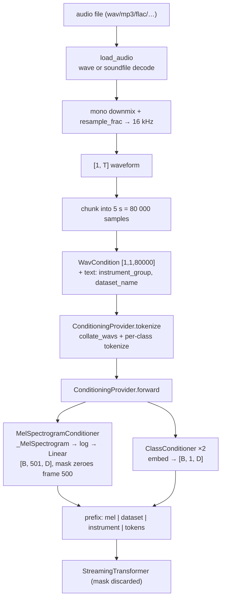

# Conditioning and the audio front-end

This chapter covers the entire input side of muscriptor: how a raw audio file on disk becomes the floating-point tensors that steer the language model. The transcription pipeline (see `01-pipeline.md`) loads audio, cuts it into fixed 5-second chunks, and asks this subsystem to turn each chunk — plus optional instrument/dataset hints — into *condition tensors*. Those tensors are prepended to the token sequence as a prefix, so the transformer (see `02-model-core.md`) literally reads the audio (as a log-mel spectrogram) and the class hints before it starts emitting note tokens. Everything here is inference-only: the four primary files contain no training code, no dataset loading, and no augmentation — just the deterministic path from a `.wav`/`.mp3`/`.flac` to `(embedding, mask)` pairs.

The moving parts, in dependency order:

- `muscriptor/utils/resample.py` — a self-contained Julius sinc resampler.
- `muscriptor/utils/audio.py` — file decoding (stdlib `wave` + `soundfile`), mono downmix, resample to 16 kHz.
- `muscriptor/modules/mel_spectrogram.py` — a pure-torch reimplementation of `torchaudio`'s `MelSpectrogram`.
- `muscriptor/modules/conditioners.py` — the data model (`ConditioningAttributes`, `WavCondition`), the two conditioners (`MelSpectrogramConditioner`, `ClassConditioner`), and the `ConditioningProvider` that batches and runs them.

## The conditioning data model

Two types carry conditioning information, both defined in `conditioners.py`.

`WavCondition` (`muscriptor/modules/conditioners.py:28`) is a `NamedTuple` with five fields:

```python
class WavCondition(NamedTuple):
    wav: torch.Tensor          # [B, 1, T] mono waveform (channel dim kept)
    length: torch.Tensor       # [B] valid sample count per row
    sample_rate: list[int]     # per-row source rate
    path: list[str | None] = []
    seek_time: list[float | None] = []
```

`wav` is always 3-D `[B, 1, T]` — batch, a singleton channel, and time in samples. `length` records how many of those `T` samples are real (the rest are right-padding introduced by `collate_wavs`). `sample_rate`, `path`, and `seek_time` are Python lists carried alongside the tensors as bookkeeping.

An important subtlety: **`path` and `seek_time` are plumbed through the whole conditioner stack but never consumed by any computation.** They are copied in `MelSpectrogramConditioner.tokenize` (`conditioners.py:154`), collected in `collate_wavs` (`conditioners.py:253`), and set to `[0.0]` when the pipeline builds a chunk (`transcription_model.py:635`), but no conditioner reads them. The `seek_time` that actually matters for decoding is a *different* field — it lives on `ChunkBoundary` / the event decoder in `events.py` and is populated from a separate `seek_times` list in `transcription_model.py:381`, not from `WavCondition.seek_time`. Do not confuse the two.

`ConditioningAttributes` (`conditioners.py:36`) is a dataclass grouping conditions by modality:

```python
@dataclass
class ConditioningAttributes:
    text: dict[str, str | None]          = field(default_factory=dict)
    wav: dict[str, WavCondition]         = field(default_factory=dict)
    joint_embed: dict[str, Any]          = field(default_factory=dict)
    symbolic: dict[str, Any]             = field(default_factory=dict)
```

Each dict is keyed by *attribute name* (the conditioner's key), not by type. At inference the pipeline populates exactly one `wav` attribute — `"self_wav"` — and two `text` attributes — `"instrument_group"` and `"dataset_name"` (`transcription_model.py:637`). The `joint_embed` and `symbolic` dicts exist for config compatibility and are never filled. `__getitem__` (`conditioners.py:43`) lets you write `attrs["text"]`, and the `*_attributes` properties plus the `condition_types()` classmethod (`conditioners.py:71`) enumerate the four modality names; only `text` and `wav` are load-bearing.

Note the type asymmetry that the naming hides: **`text` values are raw strings** (e.g. `"19 20"`), consumed by `ClassConditioner`; **`wav` values are `WavCondition` tuples**, consumed by `MelSpectrogramConditioner`. The `ConditioningProvider` decides which conditioner handles which attribute by `isinstance`, not by which dict it came from (`conditioners.py:284`).

### Expressing "unconditional"

A `None` value expresses *absence* of a condition, and each modality has its own null encoding:

- **text**: the value is literally `None` (`transcription_model.py:644` always passes `dataset_name=None`). `ClassConditioner.tokenize` maps `None` to a dedicated null row.
- **wav**: `nullify_wav` (`conditioners.py:76`) replaces the waveform with a `[..., 1]` zero tensor and sets `length` to zero, `path`/`seek_time` to `[None]`:

```python
def nullify_wav(cond: WavCondition) -> WavCondition:
    B = cond.wav.shape[0]
    return WavCondition(
        wav=torch.zeros(*cond.wav.shape[:-1], 1, device=cond.wav.device),
        length=torch.zeros(B, dtype=cond.length.dtype, device=cond.wav.device),
        sample_rate=cond.sample_rate, path=[None] * B, seek_time=[None] * B,
    )
```

`nullify_all_conditions` (`conditioners.py:87`) deep-copies a batch and nulls every wav and text attribute. It exists to build the *unconditional* half of a classifier-free-guidance (CFG) batch: the LM calls it when `cfg_coef != 1.0` and concatenates `conditions + null_conditions` before tokenizing (`lm.py:317`). The deep-copy is deliberate — the test `test_nullify_all_conditions` asserts the originals are untouched (`tests/test_conditioners.py:167`).

## ConditioningProvider: the tokenize / forward two-phase API

`ConditioningProvider` (`conditioners.py:272`) is an `nn.Module` holding the conditioners in an `nn.ModuleDict` (so they move with `.to(device)` and appear in the state dict). For muscriptor it is built in `transcription_model.py:195` with exactly three conditioners, in this insertion order:

```python
conditioners={
    "self_wav":        mel_cond,   # MelSpectrogramConditioner
    "instrument_group": inst_cond, # ClassConditioner(num_classes=1000)
    "dataset_name":     ds_cond,   # ClassConditioner(num_classes=4)
}
```

The provider partitions its conditioners by type at property-access time: `wav_conditions` are the `MelSpectrogramConditioner`s and `text_conditions` are the `ClassConditioner`s (`conditioners.py:284`, `:290`). Given the insertion order above, `text_conditions == ["instrument_group", "dataset_name"]` and `wav_conditions == ["self_wav"]`.

Conditioning runs in two phases, mirroring audiocraft's design:

**Phase 1 — `tokenize(list[ConditioningAttributes]) -> dict[str, Any]`** (`conditioners.py:298`). This collates the per-sample attributes into per-conditioner batches and runs each conditioner's own `tokenize`:

- Text: for every text conditioner it gathers `sample.text.get(cond)` across the batch into a `list[str | None]`, then calls that conditioner's `tokenize` (`conditioners.py:301`).
- Wav: it calls `collate_wavs` (below) to build one padded `WavCondition` per wav attribute, then calls the conditioner's `tokenize` on it (`conditioners.py:309`).

The returned dict is keyed by attribute name; its insertion order is **text attributes first, then wav** — this ordering matters, see "How conditions reach the transformer".

**Phase 2 — `forward(dict) -> dict[str, ConditionType]`** (`conditioners.py:316`). It simply runs each conditioner's `forward` on its tokenized input and stores the `(embedding, mask)` pair. `ConditionType` is the alias `tuple[torch.Tensor, torch.Tensor]` — an embedding `[B, T, D]` and a mask `[B, T]` (`conditioners.py:25`).

Splitting tokenize from forward lets the LM tokenize once and run the (GPU-heavy) forward under autocast; the LM times the forward separately (`lm.py:310`).

### collate_wavs: stereo downmix and batch padding

`collate_wavs` (`conditioners.py:230`) turns a list of single-sample `ConditioningAttributes` into one batched `WavCondition` per wav attribute. Per sample it asserts `wav.dim() == 3` and batch size `B == 1` (`conditioners.py:244`), downmixes stereo to mono by channel-averaging when `K == 2` (`conditioners.py:247`), then right-pads every waveform to the batch's longest with `F.pad(w, (0, max_len - w.shape[-1]))` and concatenates along the batch dim (`conditioners.py:259`). The `length` tensors are concatenated so each row still knows its pre-pad sample count. In the muscriptor pipeline every chunk is already a fixed `5 s × 16 kHz = 80 000` samples, so padding is usually a no-op — except in the CFG batch, where nullified rows (length-1 waveforms) get padded back up to 80 000 zeros.

### Device handling

The provider stores a `device` but delegates actual device placement to each conditioner's `tokenize`: `MelSpectrogramConditioner.tokenize` moves the waveform and length to `self.device` (`conditioners.py:157`), and `ClassConditioner.tokenize` builds its `LongTensor` directly on `self.device` (`conditioners.py:221`). All three conditioners are constructed with the same device in `_build_model`, so the tokenized tensors land where the model lives.

## How conditions reach the transformer

The `(embedding, mask)` dict is handed to `LMModel`. Two facts about consumption are worth internalizing, both visible in `lm.py:166`:

```python
if first_step:
    for cond, _ in condition_tensors.values():
        input_ = torch.cat([cond, input_], dim=1)
    prepend_length = input_.shape[1] - S
```

1. **The mask is discarded.** The loop unpacks `for cond, _` — the per-condition mask never influences the transformer's attention. Conditions are prepended as ordinary prefix tokens and attended to causally like any other position. The mask's only real effect is *inside* `MelSpectrogramConditioner.forward`, where it zeroes padded mel frames in the embedding itself (see below); by the time the LM sees the tensor, masked positions are already zero vectors.

2. **Prepending reverses the dict order.** Because each `cond` is `cat`-ed to the *front*, iterating `[instrument_group, dataset_name, self_wav]` produces a final front-to-back prefix of `[mel | dataset_name | instrument_group | sequence]`. So the mel frames lead, then the two class tokens, then the real tokens. `prepend_length` is the total prefix length, computed in `generate` as `sum(cond.shape[1] for cond, _ in cfg_conditions.values())` (`lm.py:371`). For a standard 5-second chunk with no explicit instrument that is `501 (mel) + 1 (dataset) + 1 (instrument) = 503` prefix positions; requesting *N* instruments makes the instrument condition *N* tokens (see `ClassConditioner`), so the prefix grows accordingly. `prepend_length` sizes the KV cache (`lm.py:373`) and is stripped from the transformer output before the LM head runs (`lm.py:181`).

## MelSpectrogramConditioner

`MelSpectrogramConditioner` (`conditioners.py:103`) is the audio-to-embedding path: waveform → log-mel spectrogram → linear projection to model dimension.

### Construction and geometry

In production it is built with `n_fft=2048, frame_rate=100, n_mel_bins=512, log_scale=True, eps=1e-6, normalize_audio=False` at `sample_rate=16000` (`transcription_model.py:181`). From these:

- **Hop length.** With the default `fine_frame_rate=None`, `fine_frame_rate_ratio == 1`, the code asserts `sample_rate % frame_rate == 0` and sets `hop_length = sample_rate // frame_rate = 16000 // 100 = 160` samples (`conditioners.py:136`). Ten milliseconds per frame.
- **Feature dimension.** `self.dim = n_mel_bins * fine_frame_rate_ratio = 512` (`conditioners.py:126`). The `fine_frame_rate` argument is accepted for config compatibility and, when set, would stack consecutive fine frames into one coarse frame (`conditioners.py:172`); it is unused in every shipped config, so `dim == 512`.
- **Projection.** `self.output_proj = nn.Linear(512, output_dim)` maps mel bins to the transformer width (`cfg.dim`: 768/1024/1536 for small/medium/large) (`conditioners.py:128`).
- **Mel transform.** A `_MelSpectrogram` is built with `power=1.0, center=True, pad_mode="reflect"` (`conditioners.py:143`). Note `power=1.0` — this is a **magnitude** spectrogram (`|STFT|`), not a power spectrogram.

### tokenize and the mel pipeline

`tokenize` (`conditioners.py:153`) only moves `wav` and `length` to the device; the other fields pass through untouched.

`_mel_embedding` (`conditioners.py:160`) computes the log-mel features:

- **Null shortcut.** If `x.wav.shape[-1] == 1` it returns `torch.zeros(B, 1, dim)` immediately (`conditioners.py:161`). This only fires for a directly-nullified waveform that was never re-padded — i.e. a batch where *every* wav is null, so `collate_wavs`' `max_len == 1`. In the normal CFG batch a real 80 000-sample row forces `max_len` up, so nullified rows are padded back to full length and take the full path instead (yielding `log(eps)` frames that the mask later zeroes).
- **Optional audio normalization** (`normalize_audio`, off in production): would peak-normalize each row (`conditioners.py:168`).
- **Mel + rearrange.** `self.mel_spec_transform(wav)` returns `[B, 1, 512, T_frames]`, rearranged to `[B, T_frames, 512]` (`conditioners.py:170`).
- **Log scaling.** `torch.log(mel + self.eps)` with `eps=1e-6` (`conditioners.py:177`). There is no mean/variance normalization — just the log.

The method runs under `torch.no_grad()`, brackets the work with `torch.cuda.synchronize()`, and prints a per-call `[muscriptor] mel-spec (...)` timing line to stdout (`conditioners.py:180`) — expect this noise on every chunk.

### forward: projection and length masking

`forward` (`conditioners.py:186`) projects and masks:

```python
embeds = self._mel_embedding(x)                 # [B, T_frames, 512], float32
embeds = embeds.to(self.output_proj.weight)     # cast dtype+device to the Linear
embeds = self.output_proj(embeds)               # [B, T_frames, output_dim]
lengths = lengths / (self.sample_rate // self.frame_rate)   # samples → frames
mask = length_to_mask(lengths, max_len=embeds.shape[1]).int()
embeds = embeds * mask.float().unsqueeze(-1)    # zero the padded frames
return embeds, mask
```

`embeds.to(self.output_proj.weight)` copies both dtype and device from the projection weight, so the float32 log-mel is aligned to the parameter (the actual half-precision math happens under the LM's autocast). Length is converted from samples to frames by dividing by the hop (`80000 / 160 = 500`), and `length_to_mask` (`utils/sampling.py:6`) builds `arange(max_len) < length`. Masked frames are zeroed in the embedding — the one place masking has teeth, since the LM ignores the returned mask.

### Output length for a 5-second chunk

`torch.stft` with `center=True` and an even `n_fft` produces `1 + L // hop_length` frames. For a 5 s chunk, `L = 80 000`, `hop = 160`, giving **501 frames**. But the mask is built from `length / hop = 500`, so `length_to_mask(500, max_len=501)` marks frames 0–499 valid and **zeroes frame 500** — 500 effective mel frames plus one zeroed trailing frame. The prefix still occupies all 501 positions; the last is simply a zero vector. `test_mel_conditioner_output_shape` (`tests/test_conditioners.py:78`) exercises the shape contract on a downsized conditioner.

## ClassConditioner

`ClassConditioner` (`conditioners.py:203`) embeds small integer class ids — instrument group and dataset — into the model dimension. It is built twice: `num_classes=1000` for `instrument_group` and `num_classes=4` for `dataset_name` (`transcription_model.py:192`).

- **Table.** `nn.Embedding(num_classes + 1, output_dim)` — one extra row nominally reserved for the null/pad class; `self.pad_idx = 0` (`conditioners.py:214`).
- **tokenize** (`conditioners.py:217`): each input string is `split()` on whitespace and parsed to ints, so **one attribute can carry several class ids** — requesting multiple instruments yields `"19 20"` → two tokens. `None` becomes `[-1]`. Ragged rows are right-padded with `-1` to the batch max, then the whole tensor is shifted by `+1` (`conditioners.py:221`), so `None → 0` and class `c → c + 1`.
- **forward** (`conditioners.py:224`): `self.embed(inputs + 1)` — **a second `+1`**. The mask is all ones (`conditioners.py:226`), giving output shape `[B, L, output_dim]` with `L` = number of class ids in the row (1 for a single or null class).

The double increment is a real behavior worth understanding. Through the provider, tokenize then forward compose to `c → c + 2`, with the null class landing on embedding **row 1** — so `pad_idx = 0` is dead code and the true null row is index 1. This is harmless in practice only because the class ids are tiny: `MT3_FULL_PLUS_GROUP_NAMES` (`tokenizer/mt3.py:118`) tops out at `drums = 36`, so the largest reachable index is `36 + 2 = 38`, far inside the 1001-row table. A class id ≥ 999 would index out of bounds, but none exists. At inference `dataset_name` is always `None` (`transcription_model.py:644`), so the 5-row dataset table only ever uses row 1. `test_class_conditioner_output_shape` and `test_class_conditioner_none_input` (`tests/test_conditioners.py:115`) cover the shape and null paths but use ids small enough that they never expose the increment.

## mel_spectrogram.py internals

`mel_spectrogram.py` is a standalone, dependency-free reimplementation of `torchaudio.transforms.MelSpectrogram`, matching it for `mel_scale='htk'`, `norm=None`, and `win_length == n_fft` (module docstring, `mel_spectrogram.py:1`). It exists so the package needs no `torchaudio` at inference and so checkpoint keys round-trip.

- **HTK mel scale.** `_hz_to_mel_htk` / `_mel_to_hz_htk` (`mel_spectrogram.py:10`) implement the classic `2595 · log10(1 + f/700)` curve — HTK, not Slaney.
- **Triangular filterbank.** `melscale_fbanks` (`mel_spectrogram.py:18`) builds an `[n_freqs, n_mels]` bank by placing `n_mels + 2` equally-spaced mel points, converting to Hz, and forming overlapping triangles via `max(0, min(down_slope, up_slope))` (`mel_spectrogram.py:37`). With `norm=None` the triangles are **not** area-normalized. For muscriptor: `n_freqs = 2048//2 + 1 = 1025`, `f_min = 0`, `f_max = 8000`, `n_mels = 512`.
- **Checkpoint-compat wrappers.** `_Spectrogram` (`mel_spectrogram.py:40`) holds the `hann_window(n_fft)` buffer and `_MelScale` (`mel_spectrogram.py:49`) holds the `fb` buffer, purely so the safetensors keys `...mel_spec_transform.spectrogram.window` and `...mel_spec_transform.mel_scale.fb` match a torchaudio-derived module layout. Both are registered buffers (persistent), so they appear in the state dict even though they are deterministic.
- **forward** (`mel_spectrogram.py:89`) flattens leading dims, runs `torch.stft` (`return_complex=True`, `onesided=True`, `normalized=False`, `center=True`, `pad_mode="reflect"`, `win_length == n_fft`), takes `spec.abs() ** self.power`, then applies the filterbank with a `matmul` (transpose to put frequency last, multiply by `fb`, transpose back), and restores the leading shape. With the conditioner's `power=1.0` this yields a magnitude mel of shape `[B, 1, 512, T_frames]`.

## utils/audio.py

`audio.py` handles decoding and rate conversion, dispatching by *content* rather than file extension.

- **`_read_wav_file`** (`audio.py:14`) reads PCM WAV via the stdlib `wave` module (accepting a path or a binary file-like object) and normalizes to float32 in `[-1, 1]`, handling 8-bit unsigned (`(x-128)/128`), 16-bit, packed 24-bit (manual little-endian assembly with sign extension, `audio.py:39`), and 32-bit PCM. It returns `[C, T]` and raises on other sample widths.
- **`_read_non_wav_file`** (`audio.py:56`) lazily imports `soundfile` (libsndfile) for mp3/flac/ogg/m4a/etc., reading as float32 and promoting mono to `[T, 1]` before transposing to `[C, T]`. The `ImportError` message points at `pip install soundfile`.
- **`resample`** (`audio.py:81`) is a thin wrapper over `resample_frac` that short-circuits when `orig_freq == new_freq`.
- **`load_audio`** (`audio.py:92`) is the public entry: it *tries* the stdlib WAV reader and, on `wave.Error`/`EOFError`, falls back to `soundfile` (`audio.py:106`). So a misnamed file — e.g. an MP3 saved as `.wav` — still loads. It then downmixes to mono by averaging channels (`audio.py:108`) and resamples to `target_sr` (default 16 000). It returns `[1, T]`. The pipeline's `_load_wav` calls this for path inputs and applies the same mono/resample logic to raw-tensor inputs (`transcription_model.py:603`).

## utils/resample.py

`resample.py` is a vendored copy of Julius (`adefossez`), a differentiable sinc resampler implementing the Julius O. Smith algorithm (`resample.py:1`). It is optimized for rational ratios whose reduced numerator/denominator are small — exactly the case for common audio rates into 16 kHz.

- **`sinc`** (`resample.py:22`) is `sin(x)/x` with the `x == 0` limit set to 1, expecting a pre-multiplied argument (the `π` is applied by the caller).
- **`ResampleFrac.__init__`** (`resample.py:39`) requires integer rates, divides both by their GCD (`resample.py:71`), stores `zeros=24` (sinc lobes to keep) and `rolloff=0.945` (anti-alias margin), and precomputes kernels via `_init_kernels`.
- **`_init_kernels`** (`resample.py:79`) returns early when the reduced rates are equal (identity). Otherwise it builds `new_sr` filters: it lowpasses at `rolloff · min(new_sr, old_sr)` (rolloff is applied even when upsampling, to suppress edge artifacts, `resample.py:85`), computes a kernel half-width, and for each output phase `i` samples a windowed sinc (`cos²` window, `resample.py:118`) then normalizes each kernel to unit sum so a constant signal is preserved (`resample.py:121`). Kernels are stacked into a `[new_sr, 1, width]` conv buffer.
- **`forward`** (`resample.py:126`) `replicate`-pads the signal, runs a single `F.conv1d` with `stride=old_sr` (the algorithm's core trick: successive output samples reuse the same filter on an `old_sr`-shifted input, `resample.py:107`), transposes the phase dimension back into time, and trims to the exact output length. Output length defaults to `floor(new_sr · T / old_sr)`; `full=True` returns the `ceil` length; an explicit `output_length` is validated against that ceiling (`resample.py:159`). The same-rate case returns the input unchanged (`resample.py:142`).
- **`resample_frac`** (`resample.py:174`) is the functional wrapper `audio.py` uses. Its docstring warns that it **rebuilds the kernel on every call** — fine for one-shot loads, but a `ResampleFrac` instance should be cached in a hot loop. muscriptor calls it once per file at load, so the cost is negligible.

## Flow



## Gotchas & invariants

- **`WavCondition.wav` is always `[B, 1, T]`.** `collate_wavs` asserts `dim() == 3` and per-sample `B == 1` (`conditioners.py:244`). Stereo is mean-downmixed to mono at collate time (`conditioners.py:247`) and again in `load_audio`/`_load_wav`.
- **A 5 s chunk is 501 mel frames, not 500.** `torch.stft(center=True)` yields `1 + 80000//160 = 501`; the length mask (`80000/160 = 500`) zeroes the last frame. The prefix still occupies 501 positions.
- **The condition mask is computed but ignored by the LM.** `lm.py:166` discards it (`for cond, _`). Masking only matters because `MelSpectrogramConditioner.forward` bakes it into the embedding by zeroing padded/null frames. In particular, the CFG unconditional branch relies on this: nullified waveforms are padded back to full length and produce `log(eps)` frames, which the zero-length mask then zeroes out.
- **Prefix order is `mel → dataset_name → instrument_group → tokens`,** because prepend-cat reverses the provider's `[text…, wav]` dict order (`lm.py:168`). Anything that reasons about absolute prefix positions must account for this.
- **`ClassConditioner` increments the class id twice** (`+1` in `tokenize`, `+1` in `forward`), so `c → c + 2` and the null class is embedding **row 1**; `pad_idx = 0` is unused. Safe only because instrument-group ids max out at 36 against a 1001-row table.
- **`instrument_group` can be multiple tokens.** Whitespace-splitting in `tokenize` means N requested instruments produce N prefix tokens, lengthening `prepend_length`.
- **`WavCondition.path` and `WavCondition.seek_time` are dead metadata** on the conditioning path — carried but never read. The decode-time `seek_time` in `events.py` is unrelated.
- **`load_audio` dispatches by content, not extension** — it tries stdlib `wave` first and falls back to `soundfile` on decode error (`audio.py:106`), so misnamed files still load, but non-WAV formats require the optional `soundfile` dependency.
- **`resample_frac` rebuilds its kernel every call** (`resample.py:186`); acceptable here because resampling happens once per file at load.
- **The mel path prints unconditional timing lines to stdout** (`conditioners.py:180`) and wraps work in `cuda.synchronize()`; this is instrumentation, not logic.
- **`normalize_audio=False` and there is no mel mean/variance normalization** — the only nonlinearity is `log(mel + 1e-6)`. The magnitude spectrogram uses `power=1.0`, not a power spectrum.

## Cross-references

- `01-pipeline.md` — `TranscriptionModel` orchestration: chunking into 5 s segments, `_load_wav`, `_build_conditions`, and how `seek_times` (the decode-side kind) are threaded to the event decoder.
- `02-model-core.md` — `LMModel`/`StreamingTransformer`: how the condition prefix is prepended, `prepend_length` KV-cache sizing, CFG doubling, and sampling.
- `04-tokenizer.md` — `MT3_FULL_PLUS_GROUP_NAMES` and `instrument_group_from_names`, the source of the class-id strings fed to `ClassConditioner`.
- `05-events-decoding.md` — the `events.py` `seek_time`/`ChunkBoundary` fields (distinct from `WavCondition.seek_time`).
- `08-tests.md` — `tests/test_conditioners.py`, the behavioral evidence for the shapes and null handling described here.
