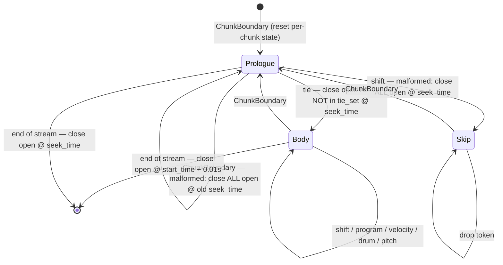

# The event stream: decoding model tokens and MIDI serialization

This chapter covers the last leg of the transcription pipeline: turning the model's flat stream of integer tokens into structured note events, and turning those events into a MIDI file. The model in `muscriptor/models/lm.py` emits one integer per timestep; `TranscriptionModel.transcribe` (chapter 01) wraps those integers with chunk markers and feeds them to `decode_model_tokens`, the streaming state machine in `muscriptor/events.py`. That function is the single source of the public event dataclasses every consumer sees — the CLI, the HTTP server, and `events_to_midi_bytes`. MIDI serialization then lives in two places: `muscriptor/utils/midi.py` (thin wrappers) delegating to `note_event2midi` in `muscriptor/tokenizer/notes.py` (the actual writer). The whole path is a pure function of the token stream: no model, no audio, no randomness, which is exactly why `tests/test_events.py` can exercise it end to end with hand-built token sequences.

## The public event types

Four dataclasses in `muscriptor/events.py` form the entire public vocabulary of the event stream. `transcribe` yields a `Iterator[NoteStartEvent | NoteEndEvent | ProgressEvent]`; `ChunkBoundary` is internal plumbing that never escapes the decoder.

**`NoteStartEvent`** (`muscriptor/events.py:20`) carries `pitch: int` (MIDI note number), `start_time: float` (absolute seconds), `index: int` (a globally unique, monotonically increasing id), and `instrument: str` (a human-readable group name such as `"acoustic_piano"`, or the literal `"drums"`). The `index` is the join key: it is how a later `NoteEndEvent` — and `events_to_midi_bytes` — find the matching onset.

**`NoteEndEvent`** (`muscriptor/events.py:28`) carries `end_time: float` and, crucially, `start_event: NoteStartEvent` — a reference to the whole start object, not just its id. The `start_event_index` property (`muscriptor/events.py:33`) exposes `self.start_event.index` for consumers that only want the id. Because the end holds the start by reference, a consumer can recover pitch, instrument, and onset from any end event without maintaining its own table.

**`ProgressEvent`** (`muscriptor/events.py:38`) carries `completed: int` and `total: int`: "`completed` of `total` fixed-size audio chunks transcribed." It is a coarse anchor, not a per-note signal — `completed == 0` is emitted once up front so a consumer learns `total` and gets a timing baseline, and `completed == total` marks the end. It is advisory: anything that builds notes or MIDI ignores it (see `events_to_midi_bytes` at `muscriptor/transcription_model.py:554`, which `continue`s past it).

**`ChunkBoundary`** (`muscriptor/events.py:54`) carries `seek_time: float` (this chunk's start, in seconds) and `next_seek_time: float | None` (the following chunk's start, `None` for the last chunk). It is produced by `_generate_token_stream.boundary` (`muscriptor/transcription_model.py:445`) and consumed only by `decode_model_tokens`. Its two roles: `seek_time` sets the clock origin for the chunk, and `next_seek_time` is the cutoff used to drop events the model hallucinates past the end of its 5-second window.

## `decode_model_tokens`: inputs and state

```python
def decode_model_tokens(
    stream: Iterator[int | ChunkBoundary | ProgressEvent],
    vocab: list[Event],
    instrument_for_program: Callable[[int], str],
    frame_rate: int = 100,
) -> Iterator[NoteStartEvent | NoteEndEvent | ProgressEvent]:
```

The signature is at `muscriptor/events.py:67`. `stream` interleaves `ChunkBoundary` markers, `ProgressEvent` anchors, and raw integer token indices; each boundary opens a chunk and is followed by that chunk's tokens (EOS and anything after it already stripped upstream). `vocab` is the decode table `list[Event]` from `build_event_vocab` — in the shipped path this is `MT3Tokenizer._vocab` (`muscriptor/tokenizer/mt3.py:227`), passed at `muscriptor/transcription_model.py:402`. `instrument_for_program` maps a decoded program integer to a display name; the concrete function is built by `_build_instrument_for_program` (`muscriptor/transcription_model.py:224`). `frame_rate` defaults to 100 and is the tick resolution: one shift step is `1/frame_rate = 0.01` seconds.

The decoder splits its state into two tiers.

**Persistent state**, living in the generator frame and surviving every chunk boundary:
- `open_notes: dict[tuple[int, int], NoteStartEvent]` (`muscriptor/events.py:87`), keyed by `(program, pitch)`, holding every onset not yet closed. This dict is what carries sustained notes across chunks — it is *never* reset at a boundary.
- `next_index` (`muscriptor/events.py:88`) and the `mint` closure (`muscriptor/events.py:90`), which stamps each new `NoteStartEvent` with the current `next_index` and then increments it. Because `mint` is the only place indices are issued and `next_index` is never reset, ids are globally unique and monotonic across the entire stream (verified by `test_indices_are_unique_and_monotonic`).

**Per-chunk state**, reset in the `ChunkBoundary` branch (`muscriptor/events.py:99` for initial values, `:125` for the reset):
- `seek_time`, `next_seek_time` — copied from the boundary.
- `start_tick = round(seek_time * frame_rate)` and `tick_state` — the chunk's clock origin and current position, in ticks.
- `program_state`, `velocity_state` — the running program and velocity (`None` until set).
- `in_prologue` — `True` while consuming the tie section at the head of the chunk.
- `skip_rest` — `True` after a malformed prologue, to drop the rest of the chunk.
- `tie_set` — the `(program, pitch)` pairs declared as sustained in this chunk's prologue.
- `chunk_started` — `False` until the first boundary is seen, so end-of-stream logic can tell an empty stream from a real one.

## The decoder state machine

Every chunk is read in three phases: a **tie prologue**, then the **body**, or a **skip** state if the prologue was malformed. Tokens are consumed strictly in stream order — no buffering, no end-of-chunk sort.



A `ProgressEvent` in the stream is orthogonal to this machine: it is yielded straight through and changes no state (`muscriptor/events.py:111`).

### The tie prologue and cross-chunk sustain

Each chunk begins with a *tie prologue*: a run of `(program, pitch)` declarations naming the notes that are still sounding, carried over from the previous chunk, terminated by a single `tie` token. The prologue branch is `muscriptor/events.py:140`:

- A `program` token sets `program_state` (`:159`).
- A `pitch` token, if a program is in scope, adds `(program_state, value)` to `tie_set` (`:161`). A pitch with no program yet is ignored.
- The `tie` token (`:141`) ends the prologue. It flips `in_prologue` to `False` and then closes every currently open note whose key is *not* in `tie_set`, emitting a `NoteEndEvent` at `seek_time`. This is the mechanism that force-closes notes the previous chunk left open but this chunk did not re-declare (`test_unsustained_note_closes_at_chunk_boundary`).

The subtle and important part: a note re-declared in the tie set is left untouched in `open_notes`, so its original `NoteStartEvent` — minted back in the earlier chunk and already yielded then — stays open and will be closed later by a real note-off in this chunk's body (`test_note_sustains_across_chunk_via_tie`). A tie for a note that is *not* actually open is silently ignored: it lands in `tie_set`, matches nothing in `open_notes`, and evaporates (`test_tie_for_unknown_note_is_ignored`).

Two malformed-prologue paths exist. If a `shift` token appears while still in the prologue (`muscriptor/events.py:150`) — meaning the chunk jumped to timed events without ever emitting `tie` — the decoder treats the chunk as broken: it closes *all* open notes at `seek_time`, sets `skip_rest = True`, and drops the remainder of the chunk. And if a chunk simply ends (next boundary arrives) while still `in_prologue` — it consumed only prologue tokens and never terminated them — the boundary branch at `muscriptor/events.py:120` closes all open notes at the *previous* `seek_time` before resetting. Both paths discard the tie set entirely, on the principle that an unterminated prologue cannot be trusted to have listed everything.

### The body: clock, programs, velocity, drums, pitches

Once past the `tie` token, the body (`muscriptor/events.py:168`) drives note onsets and offsets directly.

**Clock (`shift`).** A `shift` with `value > 0` sets `tick_state = start_tick + event.value` (`:169`). This is an *absolute* position within the chunk, not an accumulation: the value is the number of ticks past the chunk's start, matching how the encoder computes `shift_ticks = ne_tick - start_tick` (`tests/encode_helpers.py:62`). Absolute time is therefore `tick_state / frame_rate = (round(seek_time * frame_rate) + shift) / frame_rate`, i.e. `seek_time + shift/frame_rate` — for chunk starts that are multiples of the 5-second segment, the rounding is exact. A `shift` of value 0 is deliberately a no-op (the `> 0` guard), so a stray zero cannot yank the clock backward to the chunk origin.

**`program` / `velocity`** set `program_state` and `velocity_state` respectively (`:171`, `:173`). They are pure state updates; they emit nothing.

**`drum` (`:175`).** A drum hit is self-contained. The decoder computes `time = tick_state / frame_rate`, and if the window check passes (`next_seek_time is None or time < next_seek_time`) it mints a `NoteStartEvent` with `instrument = "drums"` and immediately yields both the start and a `NoteEndEvent` at `time + MINIMUM_NOTE_DURATION_SEC` (0.01s). A drum requires neither `program_state` nor `velocity_state`, and it is *never* placed in `open_notes` — the start/end pair is complete before the next token (`test_drum_emits_start_and_end_pair`).

**`pitch` (`:183`).** This is the note-on / note-off / retrigger path:
- If either `program_state` or `velocity_state` is `None`, the pitch is skipped — it cannot be interpreted (`:184`).
- If `next_seek_time is not None and time >= next_seek_time`, the pitch is dropped as out-of-window (`:187`, `test_events_past_next_seek_time_are_filtered`).
- Otherwise, with `key = (program_state, value)`: **if the key is already open, it is closed first** — a `NoteEndEvent` at the current `time`, popped from `open_notes` (`:190`). This runs regardless of the velocity, so both a note-off and a retrigger close the prior note.
- **Then, if `velocity_state > 0`**, a fresh `NoteStartEvent` is minted (instrument from `instrument_for_program(program_state)`), stored in `open_notes[key]`, and yielded (`:192`). A velocity of 0 means note-off: the close above already happened and nothing new opens; an orphan note-off with no open note is a silent no-op (`test_orphan_note_off_is_dropped`).

The retrigger ordering is therefore *end-of-old before start-of-new* (`test_retrigger_closes_previous`): pressing the same `(program, pitch)` again yields `NoteEnd(old)` then `NoteStart(new)`, never overlapping.

Note that this implementation does **not** use MT3's "velocity 0 as note-off riding on a note-on message" convention at the token level — velocity is an explicit token (`0` or `1`) that sets `velocity_state`, and the note-off is a separate `pitch` token decoded while `velocity_state == 0`. The velocity-0-means-note-off convention only reappears downstream, inside the MIDI writer, as an implementation detail of `NoteEvent`.

## Window filtering and why it matters

The model is trained on 5-second segments but the shift range (`max_shift_steps = 1001`, so up to 1000 ticks = 10 seconds at 100 Hz) lets it place events well past its window. Because consecutive chunks cover `[seek_time, next_seek_time)` and the *next* chunk will transcribe its own region properly, any pitch or drum at or after `next_seek_time` is dropped here (`muscriptor/events.py:177` for drums, `:187` for pitches). This prevents double-counting at chunk seams. The last chunk has `next_seek_time = None`, so nothing is filtered — whatever the model emits in the tail is kept.

## The end-of-note guarantee

The module docstring promises that "every `NoteStartEvent` is guaranteed to be followed by exactly one matching `NoteEndEvent` (same `index`)." This holds because every minted non-drum start enters `open_notes` and leaves it only by yielding an end, and every drum start is closed in the same breath. Enumerating the close paths:

1. Body note-off / retrigger — `muscriptor/events.py:190`.
2. Tie-prologue termination, for notes not re-declared — `:145`.
3. `shift`-in-prologue malformed close — `:155`.
4. Unterminated-prologue close at the next boundary — `:120`.
5. Drum start+end pair — `:180` (never enters `open_notes`).
6. End of stream while still in a prologue — `:200`.
7. End of stream, well-formed — `:203`.

The end-of-stream handler (`muscriptor/events.py:197`) closes whatever remains. If the final chunk ended mid-prologue (`chunk_started and in_prologue`), leftovers close at `seek_time`, matching the malformed-boundary behavior. Otherwise every still-open note closes at `ev.start_time + MINIMUM_NOTE_DURATION_SEC` — the minimum-duration fallback — and `open_notes` is cleared (`test_end_of_stream_closes_remaining_open_notes`). Note the asymmetry: a boundary-time force-close uses `seek_time`, but an end-of-stream well-formed close uses `start_time + 0.01s`. `test_every_start_has_exactly_one_end` drives a three-chunk session and asserts the start id set equals the end id set with no duplicates.

## From events back to MIDI

The event stream is consumed by `events_to_midi_bytes` (`muscriptor/transcription_model.py:542`), shared by `transcribe_to_midi` and the HTTP server so both produce byte-identical MIDI. It walks the stream, ignoring `ProgressEvent`s, and rebuilds `Note` objects: on a `NoteStartEvent` it opens a `Note` keyed by `ev.index` (offset provisionally equal to onset) and records `program_names[program] = instrument.replace("_", " ")`; on a `NoteEndEvent` it pops `open_notes[ev.start_event_index]`, patches the offset, and appends (`muscriptor/transcription_model.py:571`). This is the second consumer of the `index` contract. Drum-vs-melodic is decided by `ev.instrument == "drums"`, mapping to `DRUM_PROGRAM` (128) or the inverse instrument→program lookup `_program_for_instrument` (`:586`). The reassembled notes then pass through `validate_notes(fix=True)` and `trim_overlapping_notes(sort=True)` (`:579`) — a cleanup pass kept to match the legacy decoder's reference output — before serialization.

### `muscriptor/utils/midi.py`

This module is two thin wrappers. `notes_to_midi` (`muscriptor/utils/midi.py:8`) takes `notes`, `velocity=100`, `tempo_bpm=120`, and an optional `program_names` map; it converts BPM to microseconds-per-beat (`tempo_us = int(60_000_000 / tempo_bpm)`, so 120 BPM → 500000), expands notes to `NoteEvent`s via `note2note_event`, and calls `note_event2midi`. `save_midi` (`:30`) is the same but writes the result to a path. The transcription path calls `notes_to_midi` with the defaults, so shipped MIDI is always 120 BPM, note-on velocity 100, and 480 ticks per beat.

### `note_event2midi` (the actual writer)

The heavy lifting is `note_event2midi` in `muscriptor/tokenizer/notes.py:259`. It produces a **type-1 (multi-track)** `MidiFile` at `ticks_per_beat = 480`. Layout:

- **Track 0** is a meta track holding only `set_tempo` (`muscriptor/tokenizer/notes.py:279`).
- **One track per program.** The track key is `DRUM_PROGRAM` for drums, else the program number (`:312`). On first appearance of a key, a new `MidiTrack` is created with a `track_name` meta message and a `program_change` (`:313`). Splitting instruments into separate tracks is deliberate: DAWs like Ableton import by track and ignore channels/programs, so a single track would merge everything.
- **Channels.** Melodic programs claim channels from `list(range(0, 9)) + list(range(10, 16))` — i.e. 0–8 then 10–15 — in order of first appearance, popping from that list and sharing channel 15 on overflow (`:324`). Drums always live on channel 9 (`:319`), the GM percussion channel. The `program_change` sets the GM program to the note's program for melodic tracks, or 0 for drums.
- **Track names** come from `program_names` (the map built in `events_to_midi_bytes`), falling back to `f"program {key}"` or `"drums"`.

Timing is converted per event with `absolute_tick = round(second2tick(ne.time, ticks_per_beat, tempo))` (`:305`); at 120 BPM / 480 TPB this is 960 ticks per second. A global monotonicity guard raises `ValueError` if events arrive out of order (`:306`) — which is why the upstream cleanup sorts. Each message's `time` is the per-track delta from the previous event on that track (`:338`). Velocity is binary at this layer: `note_on` with `velocity` (100) when `ne.velocity > 0`, `note_off` with velocity 0 otherwise (`:341`).

One drum quirk: `note2note_event` (`:243`) emits only an onset `NoteEvent` for drums (the `if not note.is_drum` guard skips the offset), so `note_event2midi` synthesizes each drum's note-off itself, at `ne.time + 0.01` (`:283`). Drums therefore always render as a 0.01-second note regardless of the `Note.offset` handed in.

## Gotchas & invariants

- **`open_notes` and `next_index` are never reset at a chunk boundary** (`muscriptor/events.py:125` resets everything *except* those two). This is intentional — it is exactly how notes sustain across chunks and how ids stay globally unique.
- **`shift` is absolute-within-chunk, not cumulative**, and `shift 0` is a no-op. A shift sets `tick_state = start_tick + value`; misreading it as additive would double-advance the clock.
- **`vocab[item]` is not bounds-checked** (`muscriptor/events.py:137`). An out-of-range token index raises `IndexError`. The shipped path is safe because tokens come from the model's fixed-size logits and EOS is stripped upstream, but the test helper `decode_tokens` (in `tests/encode_helpers.py`) *does* bounds-check — the two are not interchangeable.
- **Malformed tokens are silently ignored, never warned.** A `tie` in the body, a `PAD`/`UNK`, a pitch missing program or velocity — all fall through with no branch and no log. The only stream-health warning (no-EOS-within-`max_gen_len`) is raised upstream in `_generate_token_stream`, not here.
- **Retrigger closes before it opens** (`NoteEnd(old)` precedes `NoteStart(new)`), so same-pitch notes never overlap in the event stream even if the model emits back-to-back onsets.
- **Drums are opaque start/end pairs** with a fixed 0.01s duration; they never touch `open_notes`, are never sustained by ties, and carry the literal instrument string `"drums"` — the contract the MIDI reassembler keys on.
- **The end-of-note guarantee has two different closing times.** Boundary/prologue force-closes use `seek_time`; the well-formed end-of-stream fallback uses `start_time + 0.01s`. Both satisfy "exactly one end per start," but the resulting durations differ.
- **`ProgressEvent` is emitted from two places.** The initial `completed == 0` anchor is yielded by `transcribe` *before* `decode_model_tokens` (`muscriptor/transcription_model.py:387`); the per-batch completion anchors flow *through* the decoder unchanged (`muscriptor/events.py:111`). On the CUDA path (`batch_size = 4`) these jump by four; on the web/CPU path (`batch_size = 1`) they arrive one per chunk.
- **`index` is a two-consumer contract.** `NoteEndEvent.start_event_index` matches ends to starts, and `events_to_midi_bytes` uses the same id to pop the open `Note`. Any consumer reassembling notes must key on `index`, not on `(pitch, instrument)`, because those repeat.

## Cross-references

- `01-pipeline.md` — the end-to-end flow that produces the token stream this chapter consumes, and where `transcribe` / `transcribe_to_midi` sit.
- `02-model-core.md` — `LMModel.generate`, the source of the raw integer tokens.
- `04-tokenizer.md` — `MT3Tokenizer`, `build_event_vocab`, the `Event` table and its layout, and the `forbidden_token_ids` instrument constraint.
- `03-conditioning-audio.md` — how the 5-second chunks (and their `seek_time`s) are formed.
- `06-cli-packaging.md` and `07-server-web.md` — the two consumers of the event stream and the MIDI bytes.
- `08-tests.md` — `tests/test_events.py` and `tests/encode_helpers.py`, the hermetic encode↔decode round-trip that pins this behavior.
