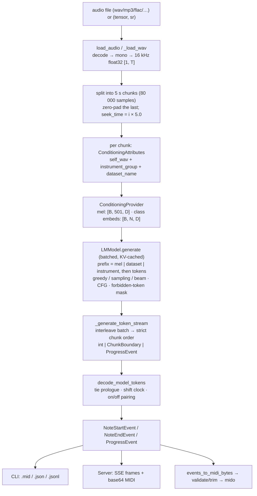

# MuScriptor — a technical deep-dive into the Python codebase

MuScriptor transcribes audio into MIDI with a decoder-only transformer language
model: audio goes in as a log-mel spectrogram prefix, MIDI comes out as a
stream of discrete tokens that a small state machine turns into note events.
This documentation set is an exhaustive tour of the **Python source code as it
ships** — every public class and function, the invariants that hold the system
together, and the sharp edges you would hit modifying it. It deliberately does
*not* cover the training method or the paper (see the README for those); it
documents what the code in `muscriptor/` and `tests/` actually does, with
`file:line` citations throughout.

The codebase is compact — about 4,100 lines of source in `muscriptor/` plus
2,300 lines of tests — but dense: a streaming KV-cached transformer, an
MT3-style token vocabulary, a chunk-stitching event decoder, three front ends
(CLI, Python API, HTTP/SSE server), and model-weight distribution via gated
HuggingFace repos.

## The system at a glance



Three facts orient everything else:

1. **The model is a plain causal LM with prefix conditioning.** There is no
   cross-attention and no encoder: the mel spectrogram (501 frames for a 5 s
   chunk) and two class embeddings are concatenated *in front of* the token
   sequence, live in the KV cache from step one, and are attended to causally.
2. **Audio is processed in independent 5-second chunks, stitched by the
   decoder.** Chunks are generated in batches for throughput, re-serialized
   into strict order, and joined by a *tie prologue*: each chunk's token stream
   opens by re-declaring the notes still sounding from the previous chunk, and
   the decoder keeps notes open across `ChunkBoundary` markers.
3. **The whole post-model path is a pure function of the token stream.** From
   token ids to events to MIDI bytes there is no randomness, no model, and no
   audio — which is why most of the test suite runs hermetically with
   synthesized token streams.

## The chapters

Read in order for a full picture, or jump to the area you're touching.

| # | Chapter | Covers | Primary files |
|---|---------|--------|---------------|
| 1 | [01-pipeline.md](01-pipeline.md) | `TranscriptionModel`: model loading & config resolution, chunking, batched interleaved streaming, note reassembly to MIDI | `transcription_model.py` |
| 2 | [02-model-core.md](02-model-core.md) | `LMModel`, the generation loop, CFG, beam search, KV cache & streaming state, SDPA kernel strategy, precision | `models/lm.py`, `modules/transformer.py`, `modules/streaming.py`, `utils/sampling.py` |
| 3 | [03-conditioning-audio.md](03-conditioning-audio.md) | The audio front-end: decoding, resampling, mel spectrogram, class conditioners, the conditioning data model | `modules/conditioners.py`, `modules/mel_spectrogram.py`, `utils/audio.py`, `utils/resample.py` |
| 4 | [04-tokenizer.md](04-tokenizer.md) | The 1393-token MT3-style vocabulary, instrument grouping & names, forbidden-token masking, the `Note` domain model | `tokenizer/mt3.py`, `tokenizer/notes.py` |
| 5 | [05-events-decoding.md](05-events-decoding.md) | `decode_model_tokens` (tie prologue, shift clock, on/off pairing, windowing) and MIDI serialization | `events.py`, `utils/midi.py` |
| 6 | [06-cli-packaging.md](06-cli-packaging.md) | The Typer CLI (all commands & flags, output formats, stdout contract), weight download/caching, `pyproject.toml` packaging | `main.py`, `__main__.py`, `__init__.py`, `utils/download.py`, `pyproject.toml` |
| 7 | [07-server-web.md](07-server-web.md) | The FastAPI server: SSE wire format, the preemption lock, soundfonts, FluidSynth auralization, static frontend serving | `server.py`, `soundfonts.py`, `utils/auralization.py` |
| 8 | [08-tests.md](08-tests.md) | What every test file locks in, the synthetic token encoder, skip gating, coverage map and honest gaps | `tests/` |

## Cross-cutting invariants

These facts span chapter boundaries; each chapter details its own side.

**Numbers that must agree with each other**

- Audio is always mono float32 at **16 kHz**; chunks are **5.0 s = 80 000
  samples**; the tokenizer/decoder clock runs at **`frame_rate = 100`** (one
  `shift` step = 10 ms). A 5 s chunk becomes **501** mel frames (500 effective;
  the 501st is masked to zero).
- The vocabulary is exactly **1393 tokens** (`build_event_vocab(1001)`:
  3 special + 1001 shift + 128 pitch + 2 velocity + 1 tie + 130 program +
  128 drum), with `eos_id = 1`. The model head width `card` is **1395** for
  medium/large and **1393** for small; `LMModel._compute_logits` hard-masks
  `logits[:, 1393:] = -inf` (`models/lm.py:223`) so the two extra head slots
  can never be sampled and `decode_model_tokens`'s unchecked `vocab[item]`
  never sees an out-of-range id. **Changing the vocabulary means updating that
  hardcoded `1393`, the mirrored layout in `tests/encode_helpers.py`, and the
  size assertion in `tests/test_notes.py:117`.**
- `max_gen_len = 2000` tokens per chunk; default batch size is **4 on CUDA, 1
  on CPU**; the server always uses **1** for latency.

**Conditioning and generation**

- Conditioning is a **causal prefix**, not cross-attention. Final prefix order
  is `mel (501) | dataset_name (1) | instrument_group (N)` then tokens —
  the *reverse* of the provider's dict order, because each condition is
  concatenated in front. The per-condition masks are **discarded** by the LM;
  masking only has effect where `MelSpectrogramConditioner` zeroes padded
  frames in the embedding itself.
- The `--instruments` constraint is enforced **twice from one list**: an
  advisory `instrument_group` class-conditioning string ("soft") and a
  `forbidden_token_ids` logits mask ("hard", the one that actually prevents
  output). Both rely on the **representative-program convention**: a group is
  identified by the *first* GM program in its `group_program_map` entry.
- CFG at `cfg_coef == 1.0` (the default everywhere) skips the unconditional
  pass entirely; any other value **doubles** the forward batch and the KV
  cache. Beam search is non-streaming, requires EOS, and gathers the whole KV
  cache every step.
- EOS stops generation **per batch, not per row** — finished chunks keep
  generating tokens that `_generate_token_stream` drops after marking the
  chunk done.

**Streaming and decoding**

- Chunks must reach the decoder **strictly in order**: the decoder's
  `open_notes` dict and note-index counter persist across `ChunkBoundary`s
  (that is how notes sustain via tie prologues and how event `index`es stay
  globally unique). `_generate_token_stream`'s buffer-and-flush logic exists
  precisely to satisfy this while generating chunks in parallel batches.
- Every `NoteStartEvent` gets exactly one matching `NoteEndEvent` (same
  `index`), enforced by seven distinct close paths in the decoder; drum hits
  are self-contained start/end pairs with a fixed 0.01 s duration and never
  enter `open_notes`.
- "Velocity" in the vocabulary is binary on/off, **not loudness** — all output
  MIDI is written at constant velocity 100, 120 BPM, 480 ticks/beat, one named
  track per program (drums on channel 9).

**Precision, devices, and front-end divergence**

- fp16 compute happens **only on CUDA**, via a `torch.autocast` wrapper built
  in `_build_model`; CPU runs full precision. The **CLI casts the model to
  fp32 after loading** (`main.py:207`); the server and library do not — the
  one behavioral divergence between front ends.
- Device auto-selection is `cuda` if available, else `cpu`; `--device auto`
  maps to `None` before reaching `load_model`.

**Process and I/O contracts**

- The CLI reserves stdout for machine output (`-o -`); all chatter goes to
  stderr. Three known leaks break this: bare `print()`s in
  `models/lm.py:313` (condition-encode timing) and
  `modules/conditioners.py:180` (mel-spec timing), and the `serve` command's
  `Loading model…` banner (`main.py:317`).
- The server runs **one transcription at a time per process** behind a
  `threading.Lock`, with newest-request-wins preemption via an explicit cancel
  event (deliberately independent of TCP disconnects). A preempted or errored
  SSE stream simply ends without its terminal `midi` frame — that frame is the
  only reliable "done" signal.
- Weights and soundfonts referenced as `hf://` URLs cache in the **HuggingFace
  hub cache** (`~/.cache/huggingface/hub/`); only plain `http(s)://` downloads
  use `~/.cache/muscriptor/`. The published weights are license-gated (free
  HF account required).

**Naming traps**

- `WavCondition.seek_time` (conditioning side) is **dead metadata** — carried,
  never read. The live `seek_time` is on `ChunkBoundary` in `events.py`,
  populated from a separate list in `transcribe()`. Same name, unrelated
  fields.
- Two "defaults" disagree by design: `_DEFAULT_SIZE = "medium"` is what a bare
  `load_model()` downloads; `_DEFAULT_CONFIG = large` is the architecture
  fallback of last resort for mystery local checkpoints.
- `main._event_to_dict` and `server.event_to_dict` are intentional duplicates
  defining the JSON wire shape — change one, change both.

## Glossary

- **chunk** — a 5-second, 80 000-sample slice of the input; the unit of model
  inference. Chunk `i` starts at `seek_time = 5.0 × i`.
- **tie prologue** — the `(program, pitch)` declarations (terminated by a
  `tie` token) at the head of each chunk's token stream, naming notes
  sustained from the previous chunk.
- **shift** — a token setting the decode clock to an *absolute* tick within
  the current chunk (`start_tick + value`), 10 ms per tick.
- **card** — the model's output-head width (1393/1395); *not* the same as the
  usable vocabulary (always 1393).
- **representative program** — the first GM program listed in a group's
  `group_program_map` entry; the only program the model emits for that group
  and the key for name↔program mapping.
- **prefix / prepend_length** — the condition embeddings concatenated before
  the token sequence (503 positions for a default 5 s chunk); sizes the KV
  cache together with `max_gen_len`.
- **ProgressEvent anchor** — advisory `completed/total` chunk-count signals
  woven into the event stream: one `completed=0` up front, then one per
  finished *batch* (per chunk only when `batch_size=1`).
- **auralization** — rendering a transcription to audio via FluidSynth,
  stereo-mixed against the original (L = original, R = synthesis) as a
  hearing check.

## Running things

```bash
uv sync                                   # install (CUDA torch on Windows via the cu128 pin)
uv run pytest                             # hermetic test suite (integration tests self-skip)
uv run muscriptor transcribe song.mp3 -o song.mid --model large
uv run muscriptor serve --model medium    # HTTP/SSE server + web UI on :8222
```

Model weights download on first use from gated HuggingFace repos
(`hf://MuScriptor/muscriptor-<size>/model.safetensors`) — accept the license
and authenticate once (`uvx hf auth login`). See
[06-cli-packaging.md](06-cli-packaging.md) for the full CLI surface and
[08-tests.md](08-tests.md) for what the tests do and don't cover.
